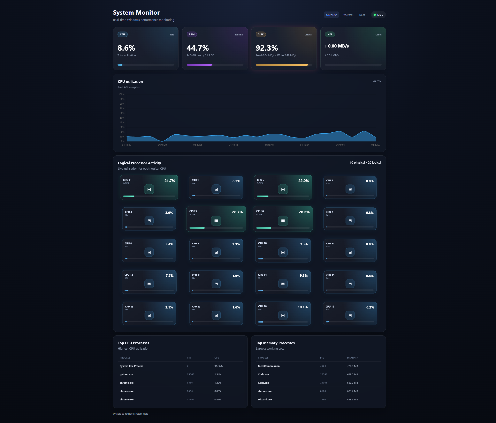
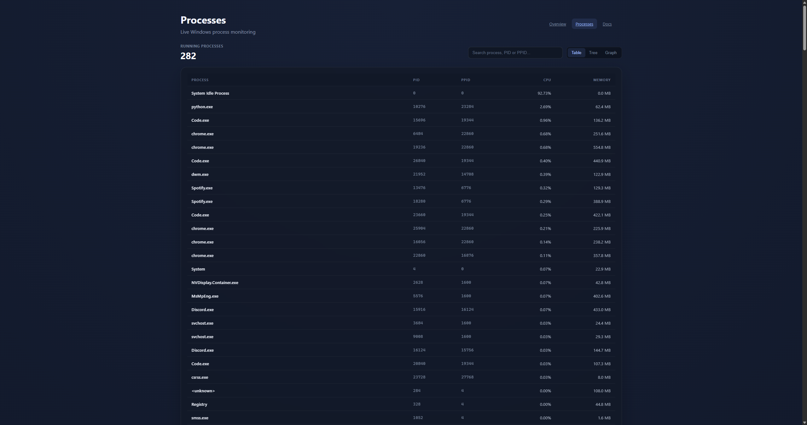
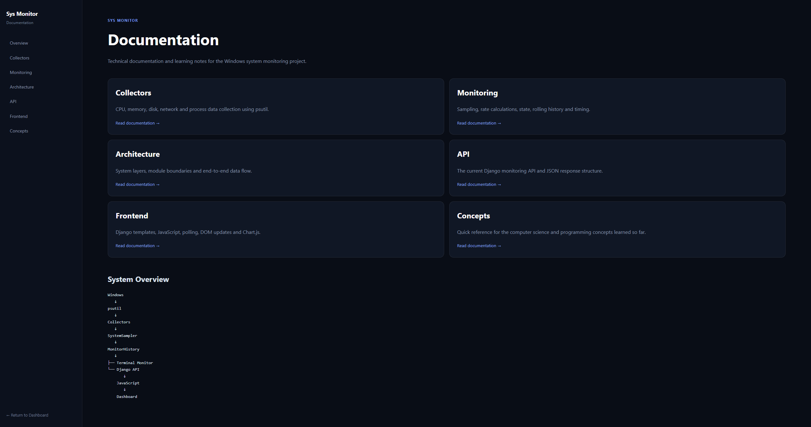

# Sys Monitor

A Windows system resource and performance monitoring application built with Python and Django.

The project collects live information about the computer's CPU, memory, disks, network activity and running processes, then displays the information through both a terminal monitor and a web dashboard.

The project is also intended as a learning tool for operating-system and computer-science concepts such as processes, CPU utilisation, memory usage, I/O, sampling, process trees and system monitoring.

---





.png)

.png)



## Quickstart

Prerequisites:
- Python 3.8+
- psutil

Install and run:
```powershell
pip install -r requirements.txt
python -m src.monitor
```

## Current Features

### System Monitoring

- Overall CPU utilisation
- CPU utilisation per logical processor
- Physical and logical CPU counts
- RAM usage
- Total, used and available memory
- Page-file usage
- Disk capacity usage
- Disk read throughput
- Disk write throughput
- Network download throughput
- Network upload throughput
- Per-interface network throughput, addresses, link speed and MTU
- Active TCP/UDP socket inspection with local/remote endpoints
- Process-to-connection mapping and reverse-DNS hostname enrichment
- Running process count


### Network Monitoring

- Dedicated `/network/` page
- Live system-wide download and upload throughput
- 60-second network throughput history
- Per-interface upload/download rates
- Interface up/down state, link speed and MTU
- IPv4, IPv6 and MAC addresses
- Current TCP and UDP sockets
- Local and remote IP/port endpoints
- TCP connection states such as `LISTEN` and `ESTABLISHED`
- Owning PID and process name where Windows/psutil exposes them
- Best-effort asynchronous reverse-DNS hostname lookup
- Search, protocol filtering and remote-only connection filtering

### Static Hardware Identification

- Windows-discovered CPU model, core counts, reported clock and cache
- GPU model, driver and Windows-reported video memory
- Physical RAM modules, capacities, slots and rated/configured speeds
- Physical disk model, capacity, media type, bus type and health
- Motherboard, BIOS/firmware and system architecture information
- Generic explanations generated from the detected hardware properties
- Hardware data is collected once and cached rather than sampled every second

### Process Monitoring

- Process ID (PID)
- Parent Process ID (PPID)
- Process name
- CPU utilisation
- Memory usage
- Top CPU-consuming processes
- Top memory-consuming processes
- Full live process list
- Process search and sortable columns
- Table and expandable parent/child tree views
- Chrome process-tree inspection

### Monitoring History

- Continuous background sampling in a dedicated Python thread
- Shared latest sample used by both monitoring APIs

The monitor keeps the most recent 60 system samples in memory.

With a sampling interval of approximately one second, this represents roughly the last 60 seconds of system activity.

The Django web monitor now collects these samples continuously in a background thread, so history continues to advance while the browser is closed as long as the Django process is running.

### Interfaces

The project currently provides:

1. A terminal-based monitor
2. A Django overview dashboard
3. A dedicated Django Processes page
4. A Django **About My PC / Hardware** page
5. A dedicated Django Memory page
6. A dedicated Django Disk page
7. A dedicated Django Network page
8. A Django documentation area

The web dashboard currently displays:

- CPU utilisation
- Memory utilisation
- Disk usage and I/O
- Network download/upload speeds
- A live 60-sample CPU graph
- Live utilisation for each logical processor
- Physical/logical CPU counts
- Top CPU process table
- Top memory process table

The dedicated Processes page provides:

- the full live process list
- PID and PPID values
- CPU and memory usage
- live search by process name, PID or PPID
- sortable process columns
- table and expandable process-tree views
- interactive graph view using Cytoscape.js and Dagre
- pan, zoom, fit and manual graph relayout controls
- CPU-coloured, memory-sized process nodes with parent/child edges

The Hardware page under `/hardware/` displays static PC specifications discovered from Windows and explains concepts such as physical/logical cores, CPU cache, RAM module speeds, SSD/NVMe storage and system architecture.

The dedicated Memory page under `/memory/` combines the shared live sample stream with cached RAM hardware information. It displays physical-memory utilisation, in-use and available memory, page-file usage, a 60-second memory history graph, top memory-consuming processes and the installed RAM modules. It also explains concepts such as available memory, working sets, caching and paging.

The dedicated Disk page under `/disk/` displays C: filesystem capacity, current read/write throughput, a 60-second I/O history graph and cached physical-drive information such as SSD/NVMe type, capacity and health. It deliberately distinguishes **storage capacity** from **disk activity**, and **filesystem volumes** from **physical drives**.

The dedicated Network page under `/network/` displays live download/upload throughput, a 60-second traffic graph, detected network interfaces and a searchable current socket table. Connections show protocol, IPv4/IPv6 family, local and remote endpoints, TCP state, owning process/PID where available, and best-effort reverse-DNS hostnames. This is **connection/socket inspection**, not packet or HTTP-content capture.

The documentation area renders the Markdown files in `docs/` as web pages under `/docs/`, including Mermaid diagrams.

---

# Technology

The project currently uses:

- Python 3.14
- psutil
- Django
- HTML
- CSS
- JavaScript
- Chart.js
- Windows PowerShell / CIM hardware queries

---

# Project Structure

```text
Sys_Monitor/
│
├── README.md
├── requirements.txt
│
├── docs/
│
└── src/
    │
    ├── collectors/
    │   ├── cpu.py
    │   ├── memory.py
    │   ├── disk.py
    │   ├── network.py
    │   ├── processes.py
    │   └── hardware.py
    │
    ├── hardware/
    │   ├── normalizer.py
    │   └── explanations.py
    │
    ├── monitoring/
    │   ├── sampler.py
    │   └── history.py
    │
    ├── dashboard/
    │   ├── services.py
    │   ├── views.py
    │   ├── urls.py
    │   ├── templates/
    │   └── static/
    │
    ├── documentation/
    │   ├── views.py
    │   ├── urls.py
    │   ├── templates/
    │   └── static/
    │
    ├── config/
    │
    ├── monitor.py
    ├── process_tree.py
    └── manage.py
```

---

# Architecture Overview

The application separates system-data collection from presentation.

```text
Windows
   │
   ├── psutil ──────────────── live performance collectors
   │                              │
   │                              ▼
   │                         SystemSampler
   │                              │
   │                              ▼
   │                 BackgroundMonitoringService
   │                              │
   │         ┌──────────┼──────────┬──────────┐
   │         ▼          ▼          ▼          ▼
   │   /api/system/ /api/processes/ /api/memory/ /api/disk/ /api/network/
   │         │          │          │          │
   │         ▼          ▼          ▼          ▼
   │      Overview   Processes   Memory      Disk      Network
   │
   └── PowerShell / CIM ─────── static hardware collector
                                  │
                                  ▼
                         normalizer + explanations
                                  │
                                  ▼
                           HardwareService
                                  │
                                  ▼
                           /api/hardware/
                                  │
                    ┌─────────────┴─────────────┐
                    ▼                           ▼
             Live dashboards              About My PC
```

The separation means the system-monitoring code is not tied to a particular user interface.

The same monitoring engine can eventually be used by:

- the terminal application
- the Django web dashboard
- continuous background monitoring
- database storage
- other applications or APIs

---

# Collectors

The collectors are responsible for retrieving raw information about the computer.

They live in:

```text
src/collectors/
```

Each collector has one main responsibility.

## CPU

`cpu.py`

Collects information such as:

- total CPU utilisation
- utilisation for each logical processor
- physical CPU core count
- logical processor count

## Memory

`memory.py`

Collects:

- total physical memory
- used memory
- available memory
- free memory
- memory utilisation percentage
- page-file total, used, free and utilisation percentage

## Disk

`disk.py`

Collects:

- total disk capacity
- used disk space
- free disk space
- disk usage percentage
- cumulative bytes read
- cumulative bytes written

The cumulative read/write counters are later used by the sampler to calculate disk throughput.

## Network

`network.py`

Collects:

- cumulative bytes sent
- cumulative bytes received
- packets sent
- packets received

The cumulative byte counters are used to calculate current upload and download rates.

## Processes

`processes.py`

Collects information about running Windows processes including:

- PID
- PPID
- process name
- CPU utilisation
- memory usage

It also provides rankings for the processes using the most CPU and memory.

---

# psutil

The project currently uses `psutil` as the main interface between Python and operating-system resource information.

Instead of each part of the project directly accessing Windows APIs, the collectors use psutil functions such as:

```python
psutil.cpu_percent()
psutil.virtual_memory()
psutil.disk_usage()
psutil.disk_io_counters()
psutil.net_io_counters()
psutil.process_iter()
```

psutil provides a convenient Python abstraction over operating-system process and resource information.

As the project develops, lower-level Windows monitoring technologies may also be explored.

---

# Sampling

Many monitoring values cannot be obtained from a useful single instantaneous measurement.

For example, disk and network APIs expose cumulative counters.

A simplified network example:

```text
Sample 1:
10,000,000 bytes received

Sample 2:
15,000,000 bytes received
```

The change is:

```text
5,000,000 bytes
```

If approximately one second passed between the measurements, the download rate was approximately:

```text
5,000,000 bytes / second
```

The `SystemSampler` handles these calculations.

---

# SystemSampler

The main monitoring orchestration logic lives in:

```text
src/monitoring/sampler.py
```

`SystemSampler`:

1. Calls each collector.
2. Maintains previous disk and network counters.
3. Measures elapsed time.
4. Calculates I/O rates.
5. Retrieves process information.
6. Determines top CPU and memory processes.
7. Produces one complete system snapshot.

A snapshot has a structure similar to:

```text
sample
│
├── timestamp
├── cpu
├── memory
├── disk
├── network
└── processes
```

This snapshot becomes the common data format used throughout the project.

---

# History

Monitoring history is handled by:

```text
src/monitoring/history.py
```

`MonitorHistory` currently uses a bounded Python `deque`.

```python
deque(maxlen=60)
```

Only the newest 60 samples are retained.

When sample 61 is added, sample 1 is automatically removed.

This gives the application a rolling history suitable for live graphs without allowing memory usage to continuously grow.

History is currently stored only in RAM and disappears when the application stops.

Persistent historical monitoring may later use a database.

---

# Terminal Monitor

The terminal interface lives in:

```text
src/monitor.py
```

It creates:

```python
SystemSampler()
MonitorHistory()
```

and then repeatedly:

```text
wait
 ↓
take sample
 ↓
add sample to history
 ↓
print system information
```

The terminal interface intentionally contains very little system-monitoring logic.

Its main responsibility is presentation.

The monitor can be stopped using:

```text
Ctrl + C
```

`KeyboardInterrupt` is handled so the program can shut down cleanly instead of displaying a traceback.

---

# Django Dashboard

Django provides the web interface.

The current web application exposes several HTML pages and JSON APIs. Important live-resource routes include:

```text
/                 → overview dashboard
/memory/           → dedicated Memory page
/disk/             → dedicated Disk page

/api/system/       → overview monitoring JSON
/api/memory/       → memory snapshot + memory history
/api/disk/         → disk snapshot + disk history
```

The dedicated resource APIs do **not** start their own collectors. They read views of the same latest sample and rolling history owned by `BackgroundMonitoringService`.

The data flow is:

```text
Browser
   │
   │ GET /api/system/
   ▼
Django view
   │
   ▼
BackgroundMonitoringService
   │
   ▼
SystemSampler
   │
   ▼
JSON response
   │
   ▼
dashboard.js
   │
   ├── update metric cards
   └── update CPU chart
```

---

# BackgroundMonitoringService

The Django monitoring service lives in:

```text
src/dashboard/services.py
```

It now owns the live web-monitoring lifecycle. It contains:

- one `SystemSampler`
- one `MonitorHistory`
- the latest complete sample
- a background sampling thread
- thread-safe events and locking

The background thread samples the PC approximately once per second even when no browser tab is open. `/api/system/`, `/api/processes/`, `/api/memory/` and `/api/disk/` no longer trigger their own collection passes; they read different views of the same latest sample and rolling history.

The service keeps the complete process list only in the latest sample, while rolling history stores smaller historical snapshots so that hundreds of process objects are not duplicated 60 times.

---

# Dashboard JavaScript

The frontend logic lives in:

```text
src/dashboard/static/dashboard/js/dashboard.js
```

The JavaScript:

1. Requests `/api/system/`.
2. Converts the response from JSON into a JavaScript object.
3. Updates the CPU, memory, disk and network cards.
4. Converts raw byte values to display units.
5. Sends CPU history to Chart.js.
6. Waits approximately one second.
7. Requests the next sample.

This creates the appearance of a live dashboard without refreshing the page.

---

# Chart.js

Chart.js is currently used to draw the CPU history graph.

The backend sends history data similar to:

```text
timestamp       CPU
20:40:01        8%
20:40:02        14%
20:40:03        27%
20:40:04        12%
```

`dashboard.js` converts that into two arrays:

```text
labels:
20:40:01
20:40:02
20:40:03
20:40:04

values:
8
14
27
12
```

Chart.js then renders those values as a line chart inside an HTML `<canvas>` element.

Chart.js is responsible for visualisation only. It does not retrieve system information itself.

---

# Running the Project

## Activate the virtual environment

From the project root:

```powershell
.\.venv\Scripts\Activate.ps1
```

If PowerShell execution policy prevents activation:

```powershell
Set-ExecutionPolicy -Scope Process -ExecutionPolicy RemoteSigned
```

Then activate the environment again.

---

## Install dependencies

```powershell
python -m pip install -r requirements.txt
```

---

## Run the terminal monitor

From the project root:

```powershell
python src\monitor.py
```

Stop with:

```text
Ctrl + C
```

---

## Run the Django dashboard

```powershell
cd src
python manage.py runserver
```

Open:

```text
http://127.0.0.1:8000/
```

The JSON system API is available at:

```text
http://127.0.0.1:8000/api/system/
```

---

# Current Limitations

The application is still an early version.

Current limitations include:

- history exists only in memory
- history is limited to 60 samples
- no persistent database history
- no authentication
- no process management actions
- no GPU performance monitoring
- disk capacity is currently centred on the C: filesystem while physical-drive identity comes from the hardware service
- no per-process or per-device live disk I/O breakdown yet
- no packet capture or protocol-payload inspection yet
- current socket data does not directly attribute byte throughput to individual processes
- reverse-DNS hostnames are best-effort and may be unavailable
- no persistent historical graphs beyond the in-memory 60-sample window
- Chart.js is currently loaded externally

These limitations are expected to change as the project develops.

---

# Planned Features

Near-term development:

- optional packet-capture / protocol-inspection Network v2
- richer process details and diagnostics
- navigation/layout cleanup as more pages are added
- self-monitoring overhead and historical analytics

Possible later additions:

- optional manufacturer/model-specific hardware enrichment
- persistent monitoring history
- SQLite/PostgreSQL storage
- Windows service mode
- GPU monitoring
- disk-per-device monitoring
- packet capture with Npcap/TShark
- per-process network byte attribution
- Wi-Fi signal/channel diagnostics
- process disk activity
- system alerts
- anomaly detection
- performance-event investigation
- Windows Performance Counters
- Event Tracing for Windows
- deeper Windows internals

---

# Learning Goals

This project is intended to explore both software engineering and computer science.

Topics covered or planned include:

- processes
- PIDs and PPIDs
- parent/child process relationships
- CPU cores and logical processors
- CPU scheduling
- memory, working sets, available memory and paging
- page files and committed-memory concepts
- disk I/O
- filesystem capacity vs disk activity
- filesystems/volumes vs physical drives
- network I/O
- cumulative counters
- sampling
- time-series data
- rolling buffers
- concurrency and locks
- REST-style APIs
- JSON
- frontend/backend communication
- asynchronous browser requests
- data visualisation
- software architecture
- separation of concerns

More detailed documentation can be found in the `docs/` directory.