# API Documentation

Sys Monitor exposes monitoring information through a Django HTTP API.

The API acts as the boundary between:

```text
Python monitoring backend
          ↓
        HTTP
          ↓
        JSON
          ↓
Browser / other clients
```

The current API is intentionally small.

At present, the main monitoring endpoint is:

```text
GET /api/system/
```

It returns the latest system measurements together with the recent CPU history used by the dashboard.

---

# API Overview

Current routes:

| Method | Endpoint       | Purpose                                                 |
| ------ | -------------- | ------------------------------------------------------- |
| `GET`  | `/`            | Render the web dashboard                                |
| `GET`  | `/api/system/` | Retrieve current monitoring data and recent CPU history |

Only `/api/system/` is currently an **API endpoint** because it returns machine-readable JSON.

The project also has normal Django HTML routes such as `/` and `/docs/.../`. These are web-page routes rather than API endpoints.

---

# Documentation Routes — Not API Endpoints

The documentation feature introduces several Django routes, but they should not be confused with the JSON monitoring API.

| Method | Route | Purpose |
| --- | --- | --- |
| `GET` | `/docs/` | Render the documentation homepage |
| `GET` | `/docs/<slug>/` | Render one Markdown documentation page |

Examples include:

```text
/docs/collectors/
/docs/monitoring/
/docs/architecture/
/docs/api/
/docs/frontend/
/docs/concepts/
```

These routes return **HTML pages**. They do not return JSON and therefore are not currently considered part of the monitoring API.

The generic route is defined using Django's path converter syntax:

```python
path(
    "<slug:slug>/",
    views.docs_page,
    name="page",
)
```

In `<slug:slug>`:

```text
first slug
    ↓
Django path converter/type

second slug
    ↓
name of the value passed to the view
```

For a request to:

```text
/docs/architecture/
```

Django calls the view approximately as:

```python
docs_page(
    request,
    slug="architecture",
)
```

The view then uses that value to select the approved Markdown document from `DOC_PAGES`.

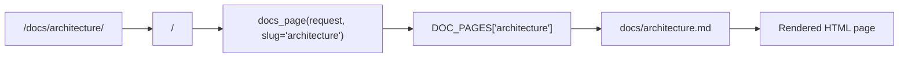

Using the `DOC_PAGES` registry also means the URL value is not blindly treated as an arbitrary file path. Only documentation pages explicitly registered by the application are exposed.

---

# API Architecture

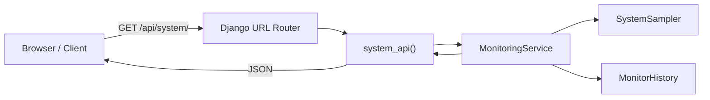

---

# Why Have an API?

Without an API, Django could directly generate all monitoring values inside the HTML template.

For example:

```text
Django
   ↓
render CPU value directly into HTML
```

That would work for an initial static page, but it would make live updates more difficult.

Instead:

```text
HTML page
    ↓
loads once

JavaScript
    ↓
requests monitoring data repeatedly

/api/system/
    ↓
returns JSON
```

This allows the page to update without being completely reloaded.

---

# Backend / Frontend Boundary

The API establishes a clear boundary between the two sides of the application.

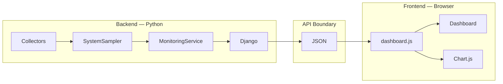

The backend does not need to know how the browser displays the information.

The frontend does not need to know how psutil retrieves it.

---

# URL Routing

The dashboard application defines its routes in:

```text
src/dashboard/urls.py
```

The current URL configuration is conceptually:

```python
urlpatterns = [
    path("", views.index, name="index"),

    path(
        "api/system/",
        views.system_api,
        name="system-api",
    ),
]
```

The project-level Django configuration includes the dashboard URLs.

```text
src/config/urls.py
```

Conceptually:

```python
urlpatterns = [
    path("admin/", admin.site.urls),
    path("", include("dashboard.urls")),
]
```

---

# URL Resolution

When Django receives:

```text
GET /api/system/
```

the request flows through the URL router:

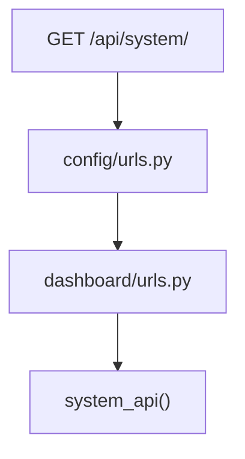

---

# `GET /api/system/`

## Purpose

Retrieve a snapshot of the computer's current system performance together with the recent CPU history.

The endpoint currently provides data for:

* CPU
* per-logical-processor CPU usage
* memory
* disk capacity
* disk read/write throughput
* network download/upload throughput
* process count
* top CPU processes
* top memory processes
* recent CPU history

---

# Request

## Method

```http
GET
```

## Path

```text
/api/system/
```

## Request Body

None.

The current endpoint does not require a request body.

## Query Parameters

None.

The current endpoint does not yet support filtering, history duration, process limits or other query parameters.

---

# Example Request

From a browser:

```javascript
const response = await fetch("/api/system/");
```

Equivalent HTTP request:

```http
GET /api/system/ HTTP/1.1
Host: 127.0.0.1:8000
```

---

# Django View

The endpoint is handled by:

```text
src/dashboard/views.py
```

The view is intentionally small:

```python
def system_api(request):
    data = monitoring_service.get_system_data()

    return JsonResponse(data)
```

Its responsibilities are:

1. receive the HTTP request
2. ask `MonitoringService` for system data
3. convert the result into an HTTP JSON response

It does not directly call psutil.

---

# Request Flow

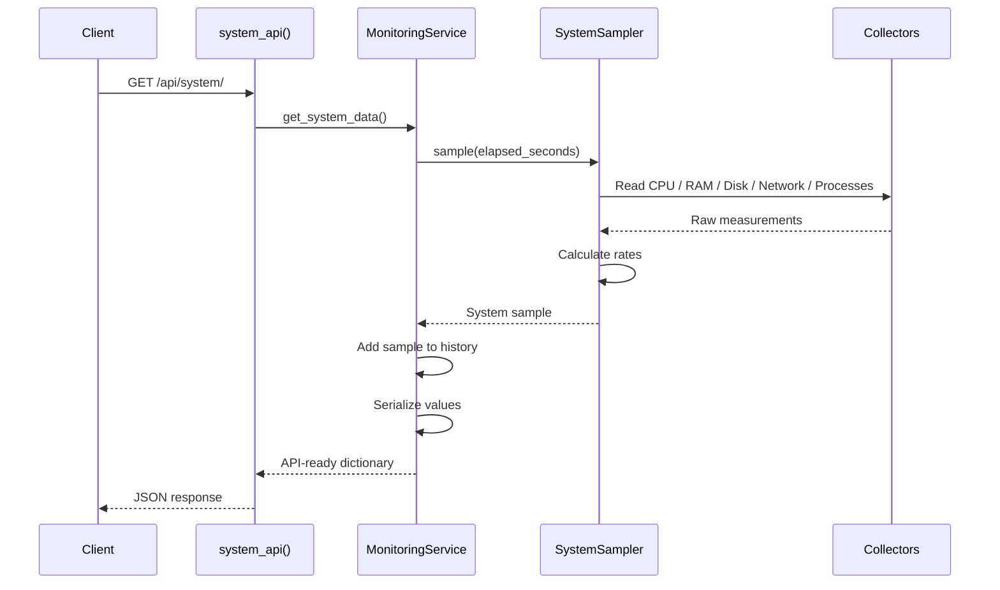

---

# Response Format

A simplified response has the following structure:

```text
response
│
├── timestamp
│
├── cpu
│   ├── percent
│   └── per_cpu_percent
│
├── memory
│   ├── percent
│   ├── total_bytes
│   ├── used_bytes
│   └── available_bytes
│
├── disk
│   ├── percent
│   ├── total_bytes
│   ├── used_bytes
│   ├── free_bytes
│   ├── read_bytes_per_second
│   └── write_bytes_per_second
│
├── network
│   ├── download_bytes_per_second
│   └── upload_bytes_per_second
│
├── processes
│   ├── count
│   ├── top_cpu
│   └── top_memory
│
└── history
    └── recent CPU samples
```

---

# Example Response

Values below are illustrative.

```json
{
    "timestamp": "2026-08-12T21:25:41.324191",

    "cpu": {
        "percent": 14.8,

        "per_cpu_percent": [
            3.2,
            10.4,
            27.1,
            6.5,
            11.3,
            9.8,
            18.2,
            4.7
        ]
    },

    "memory": {
        "percent": 48.1,
        "total_bytes": 34273824768,
        "used_bytes": 16445685760,
        "available_bytes": 17828139008
    },

    "disk": {
        "percent": 92.4,
        "total_bytes": 998848331776,
        "used_bytes": 922745000000,
        "free_bytes": 76103331776,
        "read_bytes_per_second": 4823441.73,
        "write_bytes_per_second": 1059123.51
    },

    "network": {
        "download_bytes_per_second": 3364992.14,
        "upload_bytes_per_second": 218134.28
    },

    "processes": {
        "count": 289,

        "top_cpu": [
            {
                "pid": 18320,
                "ppid": 15488,
                "name": "chrome.exe",
                "cpu_percent_raw": 72.4,
                "cpu_percent": 3.62,
                "memory_bytes": 724824064
            }
        ],

        "top_memory": [
            {
                "pid": 18320,
                "ppid": 15488,
                "name": "chrome.exe",
                "cpu_percent_raw": 72.4,
                "cpu_percent": 3.62,
                "memory_bytes": 724824064
            }
        ]
    },

    "history": [
        {
            "timestamp": "2026-08-12T21:25:39.312949",
            "cpu_percent": 8.4
        },
        {
            "timestamp": "2026-08-12T21:25:40.318204",
            "cpu_percent": 11.2
        },
        {
            "timestamp": "2026-08-12T21:25:41.324191",
            "cpu_percent": 14.8
        }
    ]
}
```

The exact values and number of logical CPU entries depend on the computer being monitored.

---

# Top-Level Fields

## `timestamp`

Type:

```text
string
```

Format:

```text
ISO 8601 datetime
```

Example:

```json
"timestamp": "2026-08-12T21:25:41.324191"
```

Represents when the system sample was taken.

Internally, the sampler stores:

```python
datetime.now()
```

The Django service converts it to a JSON-compatible string using:

```python
sample["timestamp"].isoformat()
```

---

# CPU Object

```json
"cpu": {
    "percent": 14.8,
    "per_cpu_percent": [...]
}
```

---

## `cpu.percent`

Type:

```text
number
```

Unit:

```text
percent
```

Typical range:

```text
0–100
```

Example:

```json
"percent": 14.8
```

Represents overall CPU utilisation across the system.

---

## `cpu.per_cpu_percent`

Type:

```text
array of numbers
```

Unit:

```text
percent
```

Example:

```json
"per_cpu_percent": [
    4.1,
    18.4,
    7.3,
    29.6
]
```

Each position corresponds to one logical processor.

Conceptually:

```text
index 0 → logical CPU 0
index 1 → logical CPU 1
index 2 → logical CPU 2
...
```

The development PC currently exposes 20 logical processors, so its normal response contains 20 values.

---

# Memory Object

```json
"memory": {
    "percent": 48.1,
    "total_bytes": 34273824768,
    "used_bytes": 16445685760,
    "available_bytes": 17828139008
}
```

---

## `memory.percent`

Type:

```text
number
```

Unit:

```text
percent
```

Represents current system memory utilisation.

---

## `memory.total_bytes`

Type:

```text
integer
```

Unit:

```text
bytes
```

Represents total physical memory reported by the monitoring collector.

---

## `memory.used_bytes`

Type:

```text
integer
```

Unit:

```text
bytes
```

Represents currently used memory according to the operating system's memory statistics.

---

## `memory.available_bytes`

Type:

```text
integer
```

Unit:

```text
bytes
```

Represents memory estimated to be available for applications.

---

# Why Return Bytes?

The API returns quantities using raw bytes rather than formatted strings.

For example:

```json
"used_bytes": 16445685760
```

rather than:

```json
"used": "15.3 GB"
```

This keeps data separate from presentation.

Different clients can display:

```text
15.3 GB
15684 MB
16445685760 bytes
```

without requiring the API to change.

---

# Disk Object

```json
"disk": {
    "percent": 92.4,
    "total_bytes": 998848331776,
    "used_bytes": 922745000000,
    "free_bytes": 76103331776,
    "read_bytes_per_second": 4823441.73,
    "write_bytes_per_second": 1059123.51
}
```

---

## `disk.percent`

Type:

```text
number
```

Unit:

```text
percent
```

Represents filesystem capacity usage.

For example:

```text
92.4%
```

means approximately 92.4% of the monitored filesystem's capacity is occupied.

It does **not** mean the disk is 92.4% busy.

---

## `disk.total_bytes`

Type:

```text
integer
```

Unit:

```text
bytes
```

Total capacity of the monitored filesystem.

The current implementation monitors the Windows `C:` drive for capacity.

---

## `disk.used_bytes`

Type:

```text
integer
```

Unit:

```text
bytes
```

Amount of filesystem capacity currently occupied.

---

## `disk.free_bytes`

Type:

```text
integer
```

Unit:

```text
bytes
```

Amount of remaining filesystem capacity.

---

## `disk.read_bytes_per_second`

Type:

```text
number
```

Unit:

```text
bytes per second
```

Example:

```json
"read_bytes_per_second": 4823441.73
```

This is not read directly from the capacity value.

It is calculated by `SystemSampler` from changes in cumulative disk I/O counters.

---

## `disk.write_bytes_per_second`

Type:

```text
number
```

Unit:

```text
bytes per second
```

Represents the measured disk write throughput over the sampling interval.

---

# Network Object

```json
"network": {
    "download_bytes_per_second": 3364992.14,
    "upload_bytes_per_second": 218134.28
}
```

---

## `network.download_bytes_per_second`

Type:

```text
number
```

Unit:

```text
bytes per second
```

Represents the change in received network bytes divided by the measured elapsed time.

The frontend currently converts this to MB/s.

---

## `network.upload_bytes_per_second`

Type:

```text
number
```

Unit:

```text
bytes per second
```

Represents outgoing network throughput during the measured interval.

---

# Processes Object

```json
"processes": {
    "count": 289,
    "top_cpu": [...],
    "top_memory": [...]
}
```

The current API does **not** return every running process.

It returns:

* the process count
* the highest CPU-consuming processes
* the highest memory-consuming processes

A later dedicated process endpoint will expose the complete process list.

---

## `processes.count`

Type:

```text
integer
```

Example:

```json
"count": 289
```

Number of processes successfully collected during that sampling cycle.

---

# Process Entry

Entries inside `top_cpu` and `top_memory` currently contain:

```json
{
    "pid": 18320,
    "ppid": 15488,
    "name": "chrome.exe",
    "cpu_percent_raw": 72.4,
    "cpu_percent": 3.62,
    "memory_bytes": 724824064
}
```

---

## `pid`

Type:

```text
integer
```

Meaning:

```text
Process Identifier
```

Uniquely identifies the running process at that point in time.

---

## `ppid`

Type:

```text
integer
```

Meaning:

```text
Parent Process Identifier
```

Identifies the process that created or owns the parent relationship for this process.

It will later be used to construct process trees.

---

## `name`

Type:

```text
string
```

Example:

```json
"name": "chrome.exe"
```

Human-readable process executable name when available.

Processes whose names cannot be read are currently represented using a fallback such as:

```text
<unknown>
```

---

## `cpu_percent_raw`

Type:

```text
number
```

Unit:

```text
psutil process CPU percentage
```

A process fully using one logical processor may be approximately:

```text
100%
```

A process using multiple processors may exceed 100%.

---

## `cpu_percent`

Type:

```text
number
```

Unit:

```text
percent of total machine CPU capacity
```

This is the project's Task Manager-style normalised process CPU value.

Conceptually:

```text
psutil raw process CPU
           ↓
divide by logical processor count
           ↓
whole-machine percentage
```

This value is what the main process dashboard will normally display.

---

## `memory_bytes`

Type:

```text
integer
```

Unit:

```text
bytes
```

Represents the process's resident/working-set-style physical memory measurement used by the current collector.

The frontend may convert it into MB or GB.

---

# `top_cpu`

Type:

```text
array of process objects
```

Processes are sorted by:

```text
cpu_percent
```

descending.

Example:

```json
"top_cpu": [
    {
        "pid": 100,
        "name": "chrome.exe",
        "cpu_percent": 4.2
    },
    {
        "pid": 200,
        "name": "Code.exe",
        "cpu_percent": 2.3
    }
]
```

The current sampler limits the list to approximately the top five processes.

---

# `top_memory`

Type:

```text
array of process objects
```

Processes are sorted by:

```text
memory_bytes
```

descending.

Example:

```json
"top_memory": [
    {
        "pid": 100,
        "name": "chrome.exe",
        "memory_bytes": 812646400
    },
    {
        "pid": 200,
        "name": "Code.exe",
        "memory_bytes": 630718464
    }
]
```

---

# History

The API currently includes:

```json
"history": [...]
```

This contains CPU values for the samples stored by `MonitorHistory`.

The current maximum is:

```text
60 samples
```

---

# History Entry

Each entry contains:

```json
{
    "timestamp": "2026-08-12T21:25:41.324191",
    "cpu_percent": 14.8
}
```

---

## `history[].timestamp`

Type:

```text
string
```

Format:

```text
ISO 8601 datetime
```

Represents the sample time.

---

## `history[].cpu_percent`

Type:

```text
number
```

Unit:

```text
percent
```

Represents overall CPU usage for that sample.

The current API only serializes CPU history.

Memory, disk and network history are already available in the internal sample objects and may be exposed later.

---

# History Data Flow

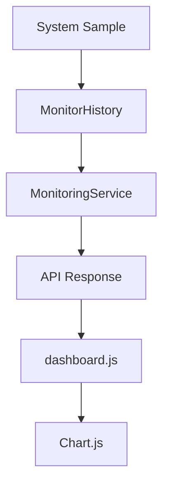

---

# Serialization

Python objects cannot always be placed directly into JSON.

For example:

```python
datetime.now()
```

creates a Python `datetime` object.

JSON has no native `datetime` type.

The service therefore serializes timestamps:

```python
sample["timestamp"].isoformat()
```

This converts:

```text
Python datetime
```

into:

```text
2026-08-12T21:25:41.324191
```

which can be safely transferred as JSON text.

---

# Serialization Boundary


---

# JSON-Compatible Types

JSON primarily supports:

```text
string
number
boolean
null
array
object
```

Our API therefore converts monitoring data into these types before returning it.

For example:

```text
datetime
    ↓
string

deque
    ↓
array/list
```

---

# Django `JsonResponse`

Django returns the API result using:

```python
JsonResponse(data)
```

Conceptually:

```text
Python dictionary
       ↓
JsonResponse
       ↓
JSON encoding
       ↓
HTTP response
```

The browser then performs:

```javascript
const data = await response.json();
```

which converts the JSON response back into a JavaScript object.

---

# Complete Frontend Data Path

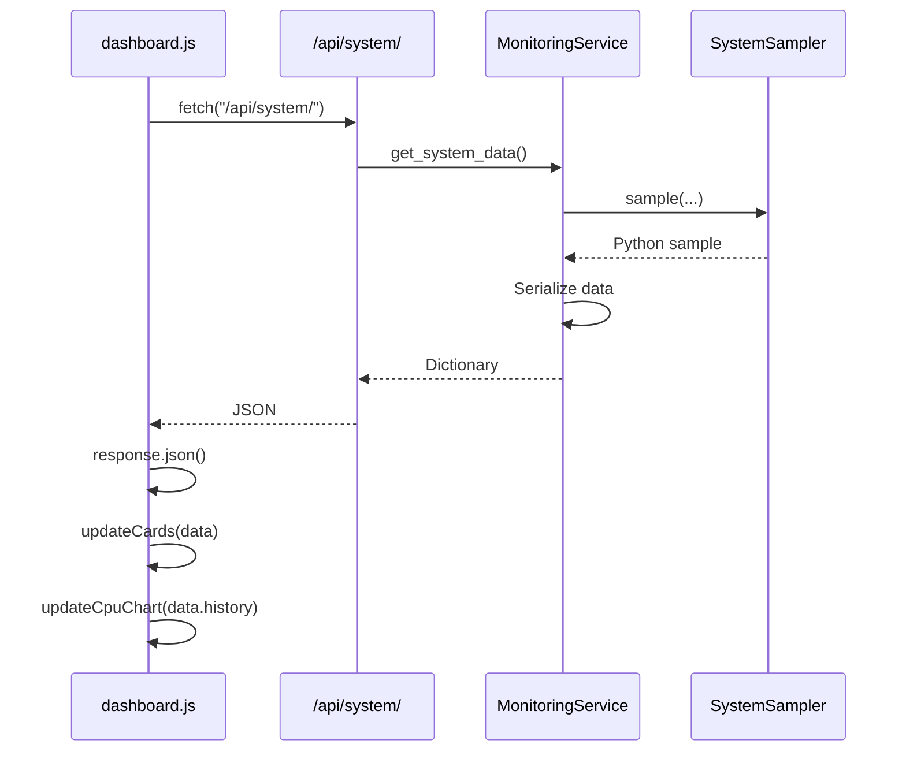

---

# Frontend Consumption

In:

```text
src/dashboard/static/dashboard/js/dashboard.js
```

the response is retrieved using:

```javascript
const response =
    await fetch("/api/system/");

const data =
    await response.json();
```

The frontend can then access:

```javascript
data.cpu.percent

data.memory.percent

data.disk.read_bytes_per_second

data.network.download_bytes_per_second

data.history
```

---

# Example CPU Card Update

API:

```json
{
    "cpu": {
        "percent": 13.748
    }
}
```

JavaScript:

```javascript
cpuValue.textContent =
    `${data.cpu.percent.toFixed(1)}%`;
```

Browser:

```text
13.7%
```

---

# Example Memory Conversion

API:

```json
{
    "memory": {
        "used_bytes": 16445685760
    }
}
```

Frontend:

```javascript
function bytesToGB(bytes) {
    return bytes / (1024 ** 3);
}
```

Browser:

```text
15.3 GB
```

The API therefore owns the measurement.

The frontend owns the display unit.

---

# CPU Chart Consumption

The API sends:

```json
"history": [
    {
        "timestamp": "...",
        "cpu_percent": 8.2
    },
    {
        "timestamp": "...",
        "cpu_percent": 14.5
    }
]
```

JavaScript transforms this using:

```javascript
history.map(
    sample => sample.cpu_percent
)
```

into:

```javascript
[
    8.2,
    14.5
]
```

Chart.js uses these values as the Y-axis data.

---

# Current Polling Model

The dashboard currently requests:

```text
/api/system/
```

approximately once per second.

The frontend uses:

```javascript
setTimeout(
    fetchSystemData,
    1000
);
```

after each completed request.

This gives the current cycle:

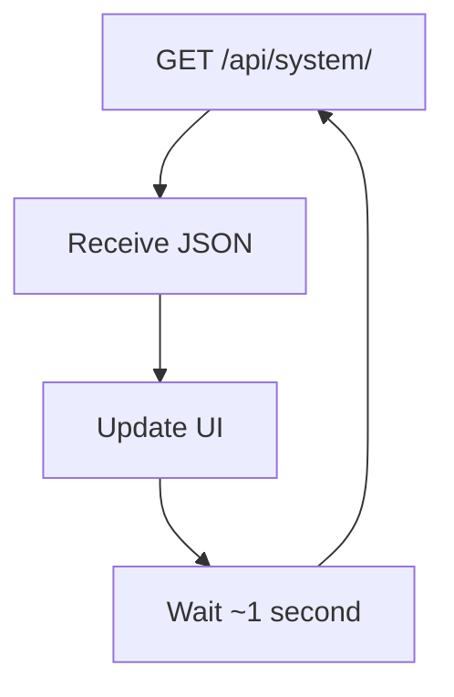

---

# Why the API Is Currently Stateful

Although HTTP GET requests are normally thought of as independent, the current monitoring service maintains state between requests.

It remembers:

```text
previous disk counters
previous network counters
previous sample time
CPU priming state
recent history
```

Therefore:

```text
request 2
```

depends partly on information retained from:

```text
request 1
```

This is required because throughput and CPU measurements depend on changes over time.

---

# Shared State

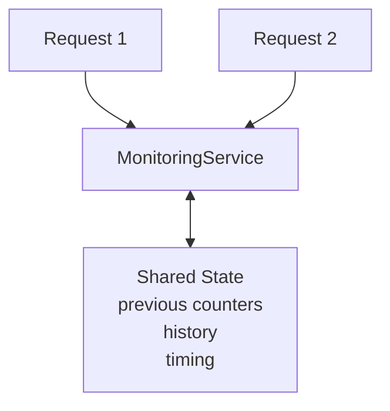

Because requests may theoretically overlap, the service currently protects this shared state using a thread lock.

---

# Concurrency Protection

Conceptually:

```text
Request A
    ↓
acquire lock
    ↓
update monitoring state
    ↓
release lock

Request B
    ↓
can then access state
```

This prevents simultaneous requests from performing conflicting updates to:

```text
previous_disk
previous_network
history
previous_time
```

---

# First API Request

The first request behaves slightly differently.

The monitoring service has not yet established baselines.

Therefore:

```text
First request
     ↓
prime sampler
     ↓
wait briefly
     ↓
take first useful sample
     ↓
return response
```

This means the first call to:

```text
/api/system/
```

can take longer than later requests.

---

# HTTP Response Status

Under normal operation the endpoint returns:

```http
200 OK
```

with a JSON response.

At the current stage, the project does not yet provide a formal custom API error response structure.

Unexpected Python or collector errors that are not already handled may therefore result in Django's normal server error behaviour.

A later API version should provide structured error handling.

---

# Proposed Future Error Format

A future error response could look like:

```json
{
    "error": {
        "code": "MONITORING_UNAVAILABLE",
        "message": "System monitoring data could not be retrieved."
    }
}
```

Possible status codes could eventually include:

| Status | Meaning                          |
| ------ | -------------------------------- |
| `200`  | Request succeeded                |
| `400`  | Invalid query or request         |
| `404`  | API resource does not exist      |
| `500`  | Unexpected server error          |
| `503`  | Monitoring subsystem unavailable |

These are not all implemented yet.

---

# Current API Characteristics

The current API is:

* local
* read-only
* JSON-based
* unauthenticated
* request-driven
* stateful internally
* designed for the local dashboard
* not yet versioned

---

# Read-Only API

The endpoint currently only reads system information.

It does **not** allow actions such as:

```text
terminate process
change priority
stop Windows service
modify hardware settings
```

This keeps the first API considerably safer and simpler.

---

# Local Usage

The development server currently runs at:

```text
http://127.0.0.1:8000/
```

The intended use is local monitoring of the same PC running Django.

The current project is not designed as a publicly exposed internet service.

---

# API Versioning

The current path is:

```text
/api/system/
```

It is not yet versioned.

A larger application might eventually adopt:

```text
/api/v1/system/
```

This would make future breaking changes easier to manage.

Versioning is unnecessary for the current early development stage.

---

# Current Limitations

The API currently has several intentional limitations.

## Only One Main Monitoring Endpoint

Most data is grouped into:

```text
/api/system/
```

This is simple but may become too large as the project grows.

---

## No Complete Process List

The endpoint currently returns:

```text
top_cpu
top_memory
```

rather than every process.

---

## No Process Detail Endpoint

There is no endpoint such as:

```text
/api/processes/18320/
```

yet.

---

## CPU-Only History Serialization

The internal samples contain other metrics, but API history currently exposes only:

```text
timestamp
cpu_percent
```

---

## No Historical Query Parameters

The API cannot currently request:

```text
last 5 minutes

last 1 hour

specific time range
```

---

## No Persistent History

History disappears when the application restarts.

---

## No Filtering

Process data cannot yet be filtered by:

```text
name
PID
CPU threshold
memory threshold
```

---

## No Pagination

A future endpoint returning hundreds of processes will probably require filtering, sorting or pagination.

---

## No Authentication

The current local API has no login requirement.

---

## No API Schema

The project does not currently generate:

* OpenAPI
* Swagger
* JSON Schema

documentation.

This Markdown document acts as the current human-readable API specification.

---

# Planned API Expansion

As the dashboard becomes more advanced, splitting system information into specialised endpoints may become useful.

Potential future API structure:

```text
/api/
│
├── system/
├── cpu/
├── memory/
├── disk/
├── network/
├── processes/
└── history/
```

---

# Possible `/api/cpu/`

Could return:

```json
{
    "percent": 14.8,
    "physical_cores": 10,
    "logical_processors": 20,
    "per_cpu_percent": [
        4.2,
        17.3
    ]
}
```

Useful for:

* dedicated CPU page
* per-core visualisation
* CPU-only refreshes

---

# Possible `/api/memory/`

Could expose more detailed memory statistics:

```json
{
    "percent": 48.1,
    "total_bytes": 34273824768,
    "used_bytes": 16445685760,
    "available_bytes": 17828139008
}
```

Later it could include:

* cached memory
* committed memory
* swap/pagefile information
* paging activity

---

# Possible `/api/disks/`

Rather than monitoring only C:, this endpoint could enumerate storage devices.

Example:

```json
{
    "disks": [
        {
            "device": "C:",
            "percent": 92.4
        },
        {
            "device": "D:",
            "percent": 61.2
        }
    ]
}
```

---

# Possible `/api/network/`

Could return information per network adapter:

```json
{
    "interfaces": [
        {
            "name": "Wi-Fi",
            "download_bytes_per_second": 3400000,
            "upload_bytes_per_second": 180000
        }
    ]
}
```

---

# Planned `/api/processes/`

A dedicated process endpoint is likely to be one of the next major additions.

Possible response:

```json
{
    "count": 289,

    "processes": [
        {
            "pid": 18320,
            "ppid": 15488,
            "name": "chrome.exe",
            "cpu_percent": 3.62,
            "memory_bytes": 724824064
        }
    ]
}
```

This endpoint would support the planned Processes page.

---

# Process API Data Flow


---

# Possible Process Detail Endpoint

A later endpoint could support:

```text
GET /api/processes/{pid}/
```

Example:

```text
GET /api/processes/18320/
```

Possible response:

```json
{
    "pid": 18320,
    "ppid": 15488,
    "name": "chrome.exe",
    "cpu_percent": 3.62,
    "memory_bytes": 724824064,
    "children": [
        19044,
        20128
    ]
}
```

Future fields could include:

* executable path
* command line
* username
* creation time
* thread count
* handle count
* disk I/O
* network connections

---

# Possible Process Tree Endpoint

For the planned expandable process tree, an endpoint might provide hierarchical data:

```json
{
    "processes": [
        {
            "pid": 1000,
            "name": "explorer.exe",
            "children": [
                {
                    "pid": 2000,
                    "name": "chrome.exe",
                    "children": [
                        {
                            "pid": 2100,
                            "name": "chrome.exe",
                            "children": []
                        }
                    ]
                }
            ]
        }
    ]
}
```

The alternative is to return a flat list containing `pid` and `ppid` and allow JavaScript to construct the tree.

Both designs have trade-offs.

---

# Flat vs Hierarchical Process API

## Flat response

```text
PID   PPID

100   0
200   100
300   200
```

Advantages:

* simple API
* easier to sort/filter
* frontend can construct different trees
* avoids deeply nested JSON

---

## Hierarchical response

```text
100
└── 200
    └── 300
```

Advantages:

* tree is ready to render
* parent/child structure already resolved

For the planned Processes page, a flat response may be more flexible because the same data can power both:

```text
table
```

and:

```text
process tree
```

---

# Possible `/api/history/`

Once history becomes persistent, a dedicated endpoint could support requests such as:

```text
/api/history/?metric=cpu&minutes=5
```

Example response:

```json
{
    "metric": "cpu",
    "samples": [
        {
            "timestamp": "...",
            "value": 12.4
        }
    ]
}
```

This is not implemented yet.

---

# Future API Query Parameters

Possible process query:

```text
/api/processes/?sort=cpu&limit=20
```

Possible history query:

```text
/api/history/?metric=memory&minutes=60
```

Possible disk query:

```text
/api/disks/?device=C:
```

Adding query parameters would allow the client to request only the information it needs.

---

# Future Push-Based Updates

The current API uses polling:

```text
browser
   ↓
GET
   ↓
response
   ↓
wait
   ↓
GET
```

A future architecture might use a persistent connection.

For example:


Instead of the browser repeatedly asking:

> Is there new data?

the server could push new samples when they become available.

This is not currently required for the first dashboard.

---

# API Design Principles

The current and future API should aim to follow several principles.

## Keep Data Machine-Readable

Prefer:

```json
"memory_bytes": 16445685760
```

over:

```json
"memory": "15.3 GB used"
```

---

## Keep Units Explicit

Field names such as:

```text
read_bytes_per_second
```

are clearer than:

```text
read_speed
```

because the unit is obvious.

---

## Keep Collection Separate from Presentation

The API should not contain CSS-related or Chart.js-specific structures.

It should expose monitoring information.

---

## Keep Endpoints Readable

Names such as:

```text
/api/system/
/api/processes/
/api/history/
```

should describe the resources they expose.

---

## Avoid Duplicating Monitoring Logic

Django endpoints should reuse:

```text
collectors
SystemSampler
MonitorHistory
```

rather than implementing new versions of the same calculations.

---

# API as a Reusable Interface

Although the current consumer is the web dashboard, the API could eventually be used by other local tools.

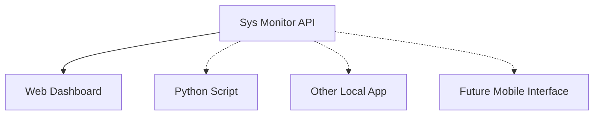

This is one reason keeping the API independent from the visual dashboard is valuable.

---

# Current End-to-End API Flow

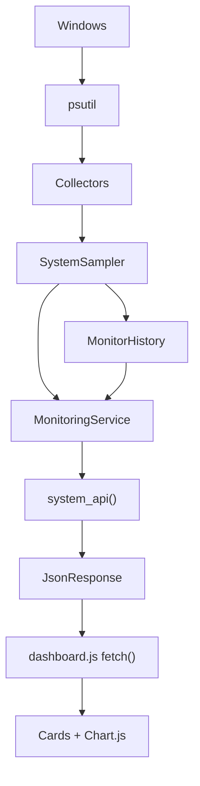

---

# Summary

The current Sys Monitor API provides one primary monitoring endpoint:

```text
GET /api/system/
```

It acts as the communication boundary between the Python monitoring backend and the browser frontend.

The backend:

```text
collects
    ↓
samples
    ↓
calculates
    ↓
serializes
```

The API then transports those values as JSON.

The frontend:

```text
fetches
    ↓
parses
    ↓
formats
    ↓
visualises
```

The current API is deliberately small and request-driven, but its structure provides a foundation for future dedicated endpoints including:

```text
/api/cpu/
/api/processes/
/api/history/
/api/network/
/api/disks/
```

The next document, `frontend.md`, explains what happens after the JSON reaches the browser: Django templates, static files, DOM manipulation, asynchronous `fetch()`, polling, data formatting, and Chart.js visualisation.
