# System Architecture

This document describes the overall software architecture of **Sys Monitor**.

While `collectors.md` explains how individual system resources are collected and `monitoring.md` explains sampling and history, this document focuses on:

* the major application layers
* module boundaries
* dependencies between components
* terminal monitoring flow
* Django dashboard flow
* API data flow
* frontend/backend communication
* the current request-driven monitoring model

The central architectural goal is:

> Keep system-data collection independent from how that data is displayed.

This allows the same monitoring engine to support multiple interfaces.

---

# High-Level Architecture

At the highest level, Sys Monitor has four major layers:

```text
Operating System
      ↓
Collection
      ↓
Monitoring
      ↓
Presentation
```

In the current application:

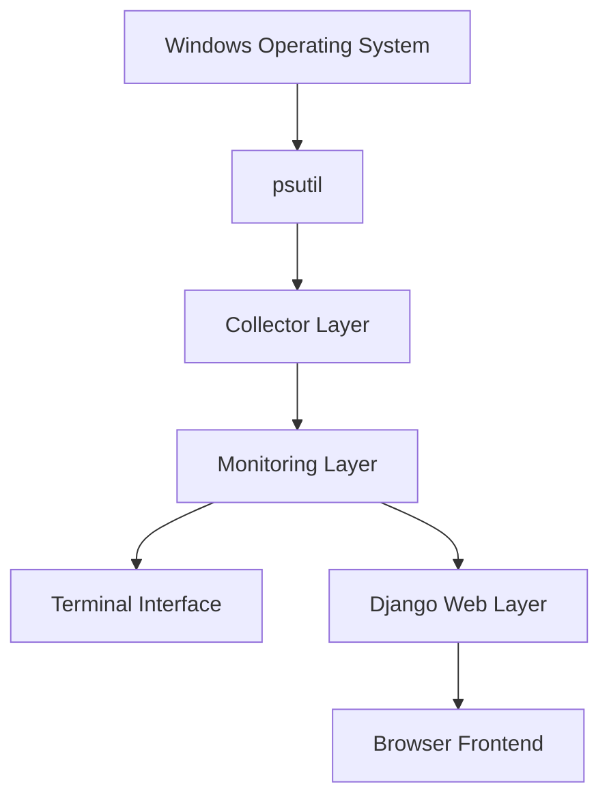

Each layer has a different responsibility.

---

# Application Layers

The current architecture can be divided into:

```text
┌──────────────────────────────────────────────┐
│                PRESENTATION                  │
│                                              │
│   monitor.py        Django       JavaScript  │
└───────────────────────▲──────────────────────┘
                        │
┌───────────────────────┴──────────────────────┐
│                 MONITORING                   │
│                                              │
│       SystemSampler    MonitorHistory        │
└───────────────────────▲──────────────────────┘
                        │
┌───────────────────────┴──────────────────────┐
│                 COLLECTION                   │
│                                              │
│ CPU   Memory   Disk   Network   Processes    │
└───────────────────────▲──────────────────────┘
                        │
┌───────────────────────┴──────────────────────┐
│               SYSTEM ACCESS                  │
│                                              │
│                   psutil                     │
└───────────────────────▲──────────────────────┘
                        │
┌───────────────────────┴──────────────────────┐
│             OPERATING SYSTEM                 │
│                                              │
│                  Windows                     │
└──────────────────────────────────────────────┘
```

This layered design reduces coupling between different parts of the project.

---

# Project Structure

The current project structure is approximately:

```text
Sys_Monitor/
│
├── README.md
├── requirements.txt
│
├── docs/
│   ├── architecture.md
│   ├── collectors.md
│   ├── monitoring.md
│   ├── api.md
│   ├── frontend.md
│   └── concepts.md
│
└── src/
    │
    ├── collectors/
    │   ├── __init__.py
    │   ├── cpu.py
    │   ├── memory.py
    │   ├── disk.py
    │   ├── network.py
    │   └── processes.py
    │
    ├── monitoring/
    │   ├── __init__.py
    │   ├── sampler.py
    │   └── history.py
    │
    ├── dashboard/
    │   ├── services.py
    │   ├── views.py
    │   ├── urls.py
    │   │
    │   ├── templates/
    │   │   └── dashboard/
    │   │       ├── index.html
    │   │       └── processes.html
    │   │
    │   └── static/
    │       └── dashboard/
    │           ├── css/
    │           │   ├── dashboard.css
    │           │   └── processes.css
    │           └── js/
    │               ├── dashboard.js
    │               └── processes.js
    │
    ├── config/
    │   ├── settings.py
    │   ├── urls.py
    │   ├── asgi.py
    │   └── wsgi.py
    │
    ├── monitor.py
    ├── process_tree.py
    └── manage.py
```

---

# Module Boundaries

A major goal of the architecture is to keep responsibilities inside clearly defined modules.

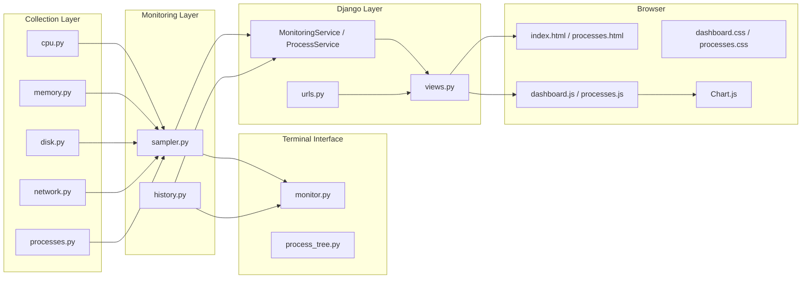

The dependency direction generally moves upward:

```text
Collectors
    ↓
Monitoring
    ↓
Interfaces
```

The collectors should not depend on Django.

The sampler should not depend on HTML.

The history component should not know that Chart.js exists.

This is intentional.

---

# Dependency Direction

A useful architectural rule for the project is:

> Lower-level monitoring code should not depend on higher-level presentation code.

Good dependency direction:

```text
dashboard
    ↓
monitoring
    ↓
collectors
    ↓
psutil
```

Avoid:

```text
collectors
    ↓
dashboard
```

or:

```text
sampler
    ↓
HTML
```

For example, this is appropriate:

```python
from monitoring.sampler import SystemSampler
```

inside the Django service.

But `sampler.py` should never need:

```python
from django.http import JsonResponse
```

because HTTP is not the sampler's responsibility.

---

# Layer 1 — Windows

At the bottom of the architecture is the operating system.

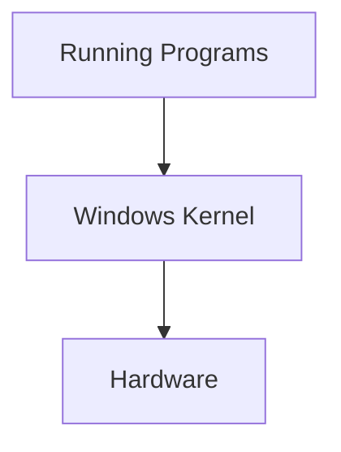

Windows manages resources such as:

* processor scheduling
* memory
* processes
* storage
* networking
* devices

Sys Monitor observes information exposed by the operating system.

The application does not directly control these resources at the current stage.

---

# Layer 2 — psutil

`psutil` acts as the main abstraction between Python and operating-system resource information.

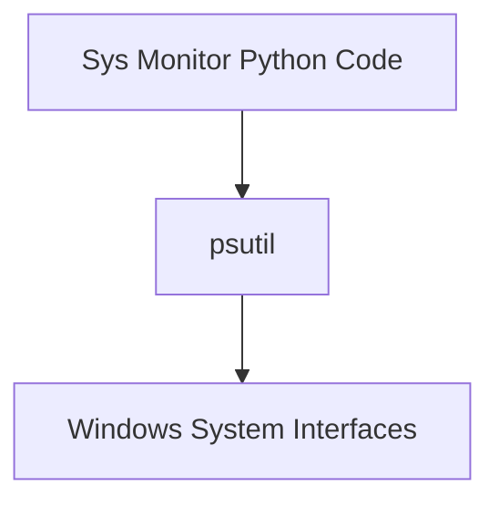

Instead of every module interacting directly with Windows APIs, the collector layer communicates through psutil.

For example:

```text
Sys Monitor
    ↓
psutil.cpu_percent()
    ↓
Windows CPU information
```

---

# Layer 3 — Collectors

Collectors isolate resource-specific retrieval logic.

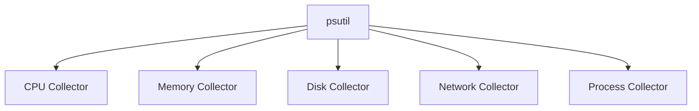

Each collector returns Python data.

Example:

```text
CPU collector
    ↓
{
    total_percent,
    per_cpu_percent,
    physical_cores,
    logical_processors
}
```

The collectors are intentionally unaware of:

* terminal formatting
* Django
* HTML
* JavaScript
* Chart.js
* HTTP
* database storage

---

# Layer 4 — Monitoring

The monitoring layer combines collector data.

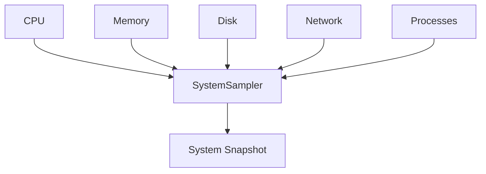

The `SystemSampler` performs operations such as:

* combining resource measurements
* calculating disk throughput
* calculating network throughput
* retrieving process rankings
* maintaining previous counter state
* creating timestamps

Its output is one complete system sample.

---

# System Sample as an Internal Contract

The system sample is an important architectural boundary.

Higher-level components receive a structure similar to:

```text
sample
│
├── timestamp
│
├── cpu
│   ├── percent
│   ├── per_cpu_percent
│   ├── physical_cores
│   └── logical_processors
│
├── memory
│   ├── percent
│   ├── total_bytes
│   ├── used_bytes
│   └── available_bytes
│
├── disk
│   ├── percent
│   ├── capacity information
│   ├── read_bytes_per_second
│   └── write_bytes_per_second
│
├── network
│   ├── download_bytes_per_second
│   └── upload_bytes_per_second
│
└── processes
    ├── count
    ├── top_cpu
    └── top_memory
```

This structure acts as an **internal contract** between the monitoring engine and its consumers.

The terminal can consume it.

Django can consume it.

A future database writer could consume it.

---

# System Sample Flow

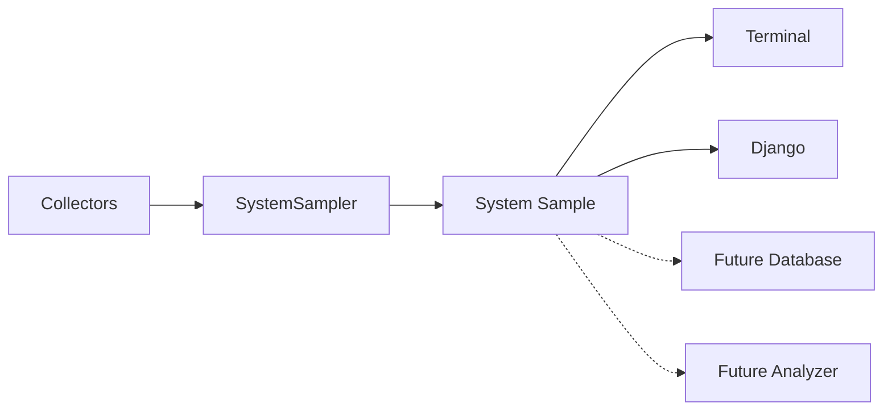

Dashed arrows represent possible future consumers.

---

# History Architecture

The sampler creates individual measurements.

`MonitorHistory` stores multiple measurements.

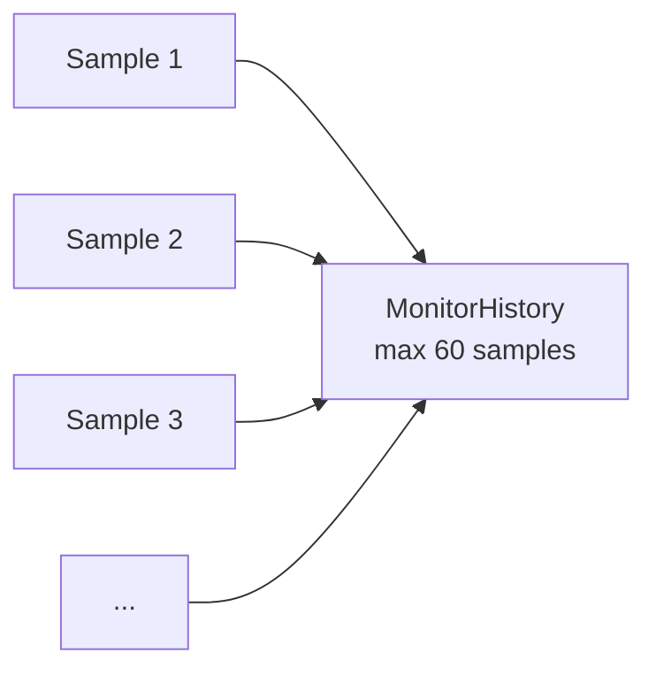

The distinction is:

```text
SystemSampler
    ↓
creates one snapshot

MonitorHistory
    ↓
retains many snapshots
```

---

# Rolling History

The current history architecture is:

```text
                         newest
                           ↓
[05][06][07][08] ... [63][64]
 ↑
oldest
```

When a new sample arrives:

```text
Before:

[05][06][07] ... [63][64]

New sample:
[65]

After:

[06][07][08] ... [64][65]
```

The oldest sample is automatically discarded.

This keeps memory use bounded.

---

# Presentation Layer

The system currently has two separate presentation paths.

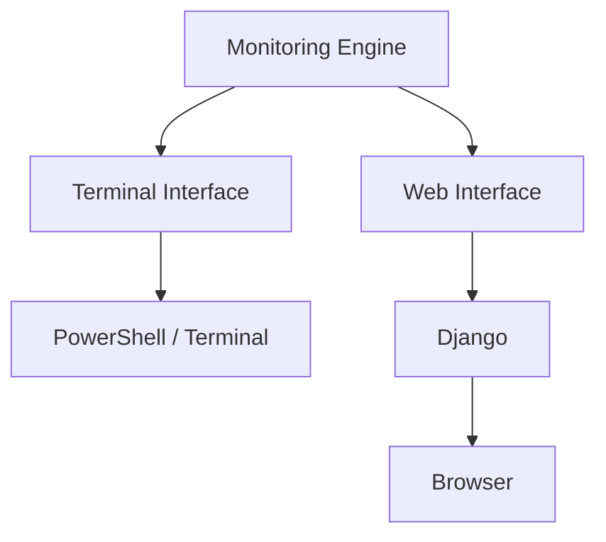

This demonstrates one of the main advantages of separating monitoring logic from presentation.

---

# Terminal Architecture

The terminal interface is:

```text
src/monitor.py
```

Its responsibility is primarily orchestration and presentation.

---

# Terminal Flow

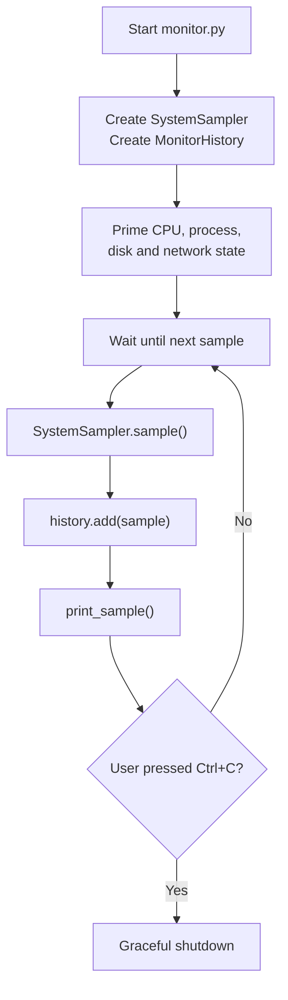

---

# Terminal Sequence

Another way to view the terminal monitor is as a sequence:

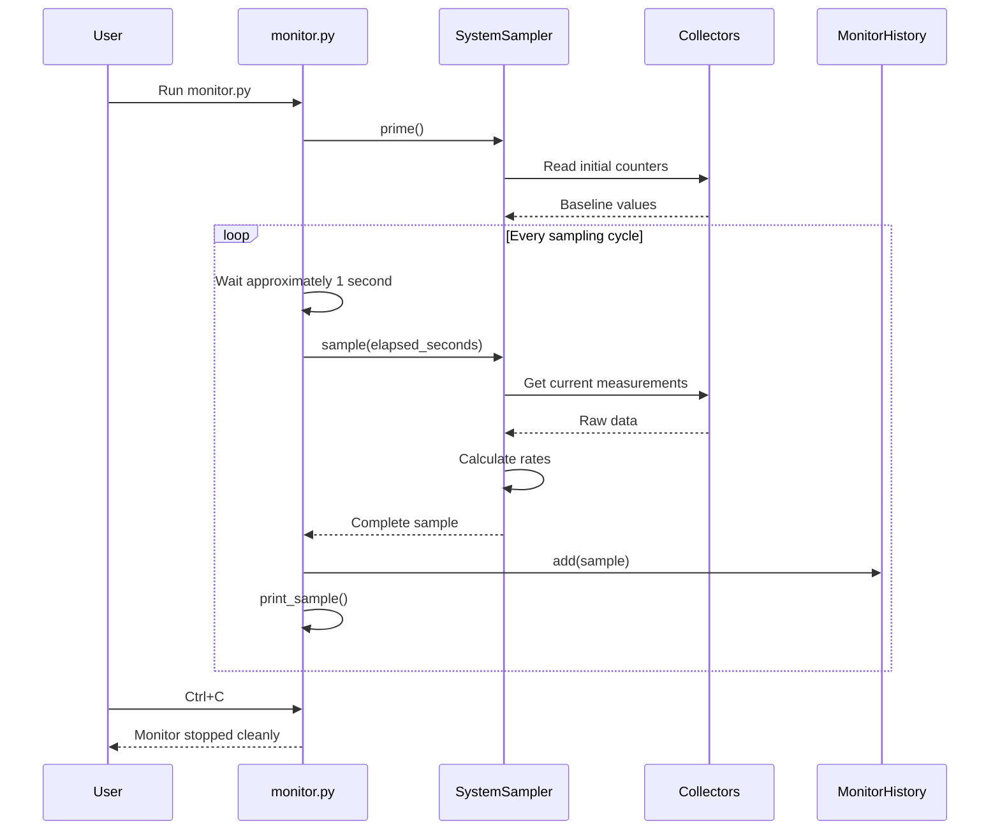

---

# Why the Terminal Interface Is Thin

`monitor.py` should not contain detailed psutil logic.

Instead of:

```text
monitor.py
├── calculate CPU
├── calculate network
├── calculate disk
├── process iteration
├── history implementation
└── printing
```

the design is:

```text
monitor.py
├── ask sampler for data
├── add to history
└── print data
```

This keeps the terminal interface replaceable.

---

# Web Architecture

The Django side adds several additional layers because the browser does not directly run the Python monitoring code.

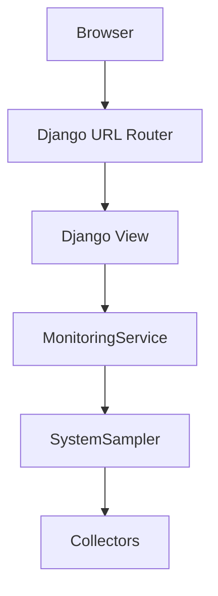

The result then flows back in the opposite direction.

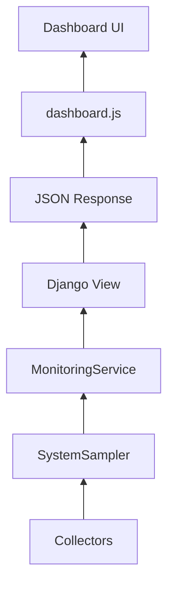

---

# Django Components

The important Django modules currently are:

```text
dashboard/
├── services.py
├── views.py
├── urls.py
├── templates/
└── static/
```

Their responsibilities are different.

---

# `urls.py`

The URL configuration determines:

> Which view should handle this URL?

Current important routes:

```text
/
```

and:

```text
/api/system/
```

Conceptually:

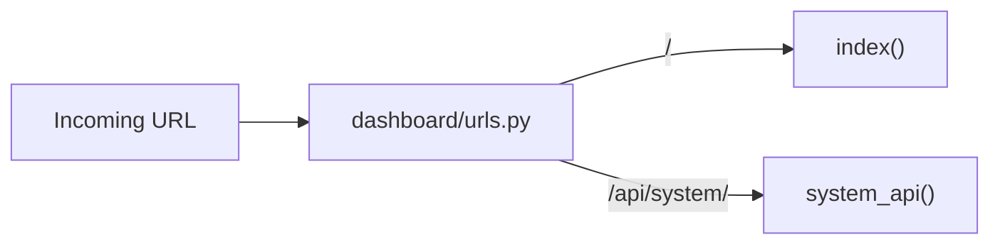

---

# `views.py`

The Django views deal with HTTP requests.

The dashboard view:

```text
GET /
    ↓
index()
    ↓
render index.html
```

The API view:

```text
GET /api/system/
    ↓
system_api()
    ↓
MonitoringService
    ↓
JSON response
```

The view should remain relatively thin.

It should not know how disk throughput is calculated.

---

# `MonitoringService`

`dashboard/services.py` acts as a bridge between Django and the monitoring engine.

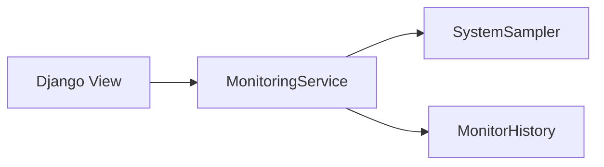

The service currently owns:

```text
MonitoringService
│
├── SystemSampler
├── MonitorHistory
├── previous timing information
├── priming state
└── threading lock
```

---

# Why Use a Service Layer?

Without `MonitoringService`:

```text
Django View
    ↓
SystemSampler
    ↓
history
    ↓
thread lock
    ↓
timing
    ↓
serialization
```

The view would have too many responsibilities.

With the service:

```text
View
    ↓
get_system_data()
    ↓
Service manages everything else
```

This gives a cleaner HTTP layer.

---

# Service Boundary

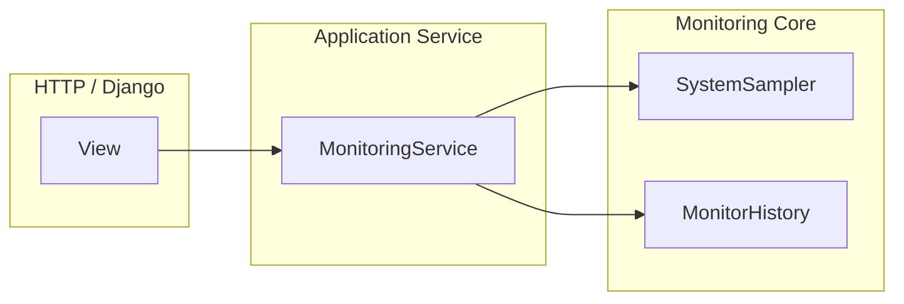

This is an important boundary.

Django-specific code lives above the monitoring core.

---

# Current API Architecture

The browser retrieves monitoring data from:

```text
/api/system/
```

using an HTTP GET request.

The complete current path is:

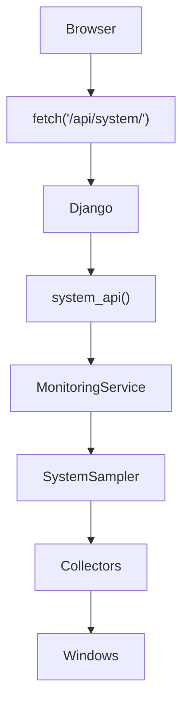

The response travels back:

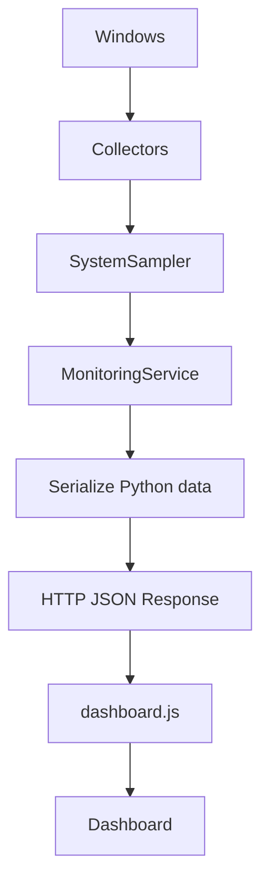

---

# End-to-End Web Request

A single dashboard refresh cycle currently looks like:

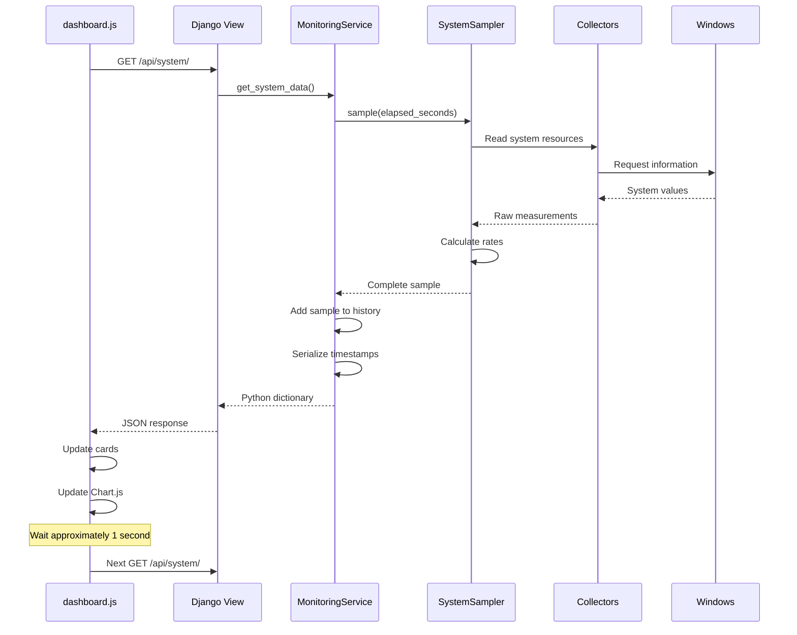

---


# Current Dashboard Presentation

The browser now uses the same `/api/system/` response for several visual components:

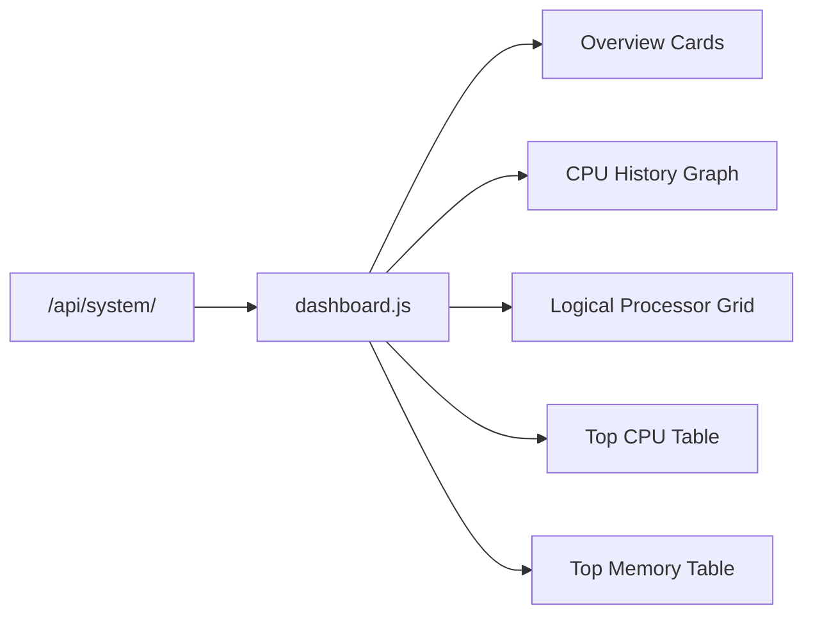

The logical-processor grid and process tables are generated dynamically from the arrays returned by the API, so the presentation adapts to the data rather than assuming a fixed number of CPU entries or process rows.

---


# Dedicated Processes Page

The web interface now has a second monitoring page at `/processes/`. It uses a separate JSON endpoint so the main system endpoint does not need to send the complete process list on every overview refresh.

```mermaid
flowchart LR
    PAGE["/processes/"]
    JS["processes.js"]
    API["/api/processes/"]
    SERVICE["ProcessService"]
    COLLECTOR["Process Collector"]

    PAGE --> JS
    JS -->|"poll"| API
    API --> SERVICE
    SERVICE --> COLLECTOR
    COLLECTOR --> SERVICE
    SERVICE --> API
    API -->|"flat PID/PPID JSON"| JS
    JS --> TABLE["Sortable / searchable table"]
    JS --> TREE["Expandable process tree"]
```

The API returns a flat list of process objects. `processes.js` uses PID/PPID relationships to build the hierarchy in the browser, so the same data can power both the table and tree views.

---

# Process Graph Architecture

The dedicated Processes page now has three presentations of the same `/api/processes/` data: Table, expandable Tree and interactive Graph. No new backend endpoint was required.

```mermaid
flowchart TD
    API["/api/processes/"] --> JS["processes.js"]
    JS --> TABLE["Table view"]
    JS --> TREE["Expandable tree"]
    JS --> CY["Cytoscape.js graph"]
    CY --> DAGRE["Dagre directed layout"]
    DAGRE --> CANVAS["Interactive process forest"]
```

Each process becomes a Cytoscape node. If its PPID is present in the current process set, JavaScript creates a directed edge from the parent PID to the child PID. Processes whose parents are absent become graph roots, so the result is usually a **forest** containing several independent trees.

The initial layout is calculated by Dagre. Live refreshes then update existing graph elements without automatically rerunning the layout, which preserves the user's pan and zoom position while inspecting the graph.

# Browser Architecture

The browser contains three main frontend technologies:

```text
HTML
CSS
JavaScript
```

plus Chart.js.

```mermaid
flowchart TD
    HTML["index.html<br/>Structure"]
    CSS["dashboard.css<br/>Presentation"]
    JS["dashboard.js<br/>Behaviour"]
    CHART["Chart.js<br/>Visualisation"]

    HTML --> PAGE["Dashboard"]
    CSS --> PAGE
    JS --> PAGE
    CHART --> PAGE
```

---

# HTML Responsibility

`index.html` defines the structure of the page.

For example:

```text
Dashboard
├── Header
├── CPU card
├── Memory card
├── Disk card
├── Network card
├── CPU chart
└── Footer
```

The initial values can contain placeholders such as:

```text
--%
```

JavaScript later replaces these values.

---

# CSS Responsibility

`dashboard.css` controls presentation:

```text
layout
spacing
fonts
background
cards
responsive behaviour
```

CSS does not retrieve monitoring data.

---

# JavaScript Responsibility

`dashboard.js` controls the live behaviour.

```mermaid
flowchart TD
    START["Page loaded"]

    FETCH["Fetch /api/system/"]

    JSON["Parse JSON"]

    CARDS["Update metric cards"]

    GRAPH["Update CPU graph"]

    WAIT["Wait ~1 second"]

    START --> FETCH
    FETCH --> JSON
    JSON --> CARDS
    JSON --> GRAPH
    CARDS --> WAIT
    GRAPH --> WAIT
    WAIT --> FETCH
```

---

# Chart.js Boundary

Chart.js is not part of the monitoring engine.

It receives ordinary frontend data and draws it.

```text
Monitoring history
       ↓
JSON
       ↓
dashboard.js
       ↓
labels + values
       ↓
Chart.js
       ↓
Canvas graph
```

For example:

```text
history
│
├── 20:10:01 → 10%
├── 20:10:02 → 14%
└── 20:10:03 → 21%
```

becomes:

```text
labels:
[20:10:01, 20:10:02, 20:10:03]

values:
[10, 14, 21]
```

Chart.js then visualises those arrays.

---

# Frontend/Backend Boundary

One of the most important architectural boundaries is HTTP/JSON.

```mermaid
flowchart LR
    subgraph Backend["Python Backend"]
        MON["Monitoring"]
        DJ["Django"]
    end

    subgraph Boundary["HTTP Boundary"]
        API["JSON API"]
    end

    subgraph Frontend["Browser"]
        JS["JavaScript"]
        UI["HTML / Chart.js"]
    end

    MON --> DJ
    DJ --> API
    API --> JS
    JS --> UI
```

Python does not directly modify browser HTML.

JavaScript does not directly call psutil.

They communicate through JSON.

---

# Why JSON?

JSON provides a language-independent data format.

Python may have:

```python
{
    "cpu": {
        "percent": 14.7
    }
}
```

Django converts it into JSON:

```json
{
    "cpu": {
        "percent": 14.7
    }
}
```

JavaScript then receives an object where it can use:

```javascript
data.cpu.percent
```

This cleanly separates backend and frontend technologies.

---

# Current Request-Driven Architecture

The current web monitor is **request-driven**.

This is an important architectural limitation to understand.

The browser causes monitoring samples to be taken.

```mermaid
flowchart TD
    Browser["Dashboard Open"]

    Request["Request /api/system/"]

    Sample["Create Monitoring Sample"]

    History["Store Sample"]

    Response["Return JSON"]

    Wait["Wait ~1 second"]

    Browser --> Request
    Request --> Sample
    Sample --> History
    History --> Response
    Response --> Wait
    Wait --> Request
```

---

# What Happens When the Dashboard Is Open?

```text
Browser open
     ↓
JavaScript runs
     ↓
GET /api/system/
     ↓
sample created
     ↓
wait
     ↓
GET /api/system/
     ↓
sample created
     ↓
...
```

The history fills:

```text
1 / 60
2 / 60
3 / 60
...
60 / 60
```

---

# What Happens When the Dashboard Is Closed?

Current architecture:

```mermaid
flowchart TD
    CLOSE["Browser closes"]

    STOP["No more API requests"]

    NOSAMPLES["No new samples"]

    HISTORY["History stops advancing"]

    CLOSE --> STOP
    STOP --> NOSAMPLES
    NOSAMPLES --> HISTORY
```

Therefore:

> The current Django dashboard does not run an independent background monitoring loop.

---

# Request-Driven Timeline

```text
Browser request
      │
      ▼
   Sample A
      │
      ▼
wait ~1 second
      │
      ▼
Browser request
      │
      ▼
   Sample B
      │
      ▼
wait ~1 second
      │
      ▼
Browser request
      │
      ▼
   Sample C
```

The browser determines when samples are generated.

---

# Why Use Request-Driven Monitoring Initially?

It is simpler to build and understand.

It avoids introducing:

* worker threads
* background processes
* services
* queues
* database persistence
* worker lifecycle management

at the same time as learning Django and frontend communication.

For the current stage, this allows development to focus on:

```text
collect
    ↓
sample
    ↓
serve JSON
    ↓
visualise
```

---

# Request-Driven Limitations

There are several limitations.

## No Browser Means No Monitoring

```text
dashboard closed
    ↓
no API requests
    ↓
no sampling
```

---

## Restarting Django Loses History

Current history exists in RAM.

```text
Django running
    ↓
history exists

Django stops
    ↓
history disappears
```

---

## Multiple Clients Are More Complicated

Suppose two browser tabs request:

```text
/api/system/
```

They share the same:

```text
MonitoringService
SystemSampler
MonitorHistory
```

This is why synchronization matters.

---

# Shared Monitoring State

The service currently owns shared mutable state:

```text
MonitoringService
│
├── sampler
│   ├── previous_disk
│   └── previous_network
│
├── history
├── previous_time
└── is_primed
```

If two requests modified this simultaneously, calculations could become inconsistent.

---

# Locking Architecture

The service therefore uses a thread lock.

```mermaid
sequenceDiagram
    participant A as Request A
    participant Lock
    participant Service
    participant B as Request B

    A->>Lock: acquire()
    Lock-->>A: granted

    A->>Service: take sample

    B->>Lock: acquire()
    Note over B,Lock: waits

    Service-->>A: sample complete

    A->>Lock: release()

    Lock-->>B: granted

    B->>Service: take sample

    Service-->>B: sample complete

    B->>Lock: release()
```

This ensures one operation updates the sampling state at a time.

---

# Current Runtime Components

When the Django dashboard is running, the important runtime components are approximately:

```mermaid
flowchart LR
    subgraph Machine["Windows PC"]
        Django["Django Development Server"]
        Python["Python Monitoring Code"]
        Browser["Web Browser"]

        Django --> Python
        Browser <--> Django
    end
```

Both the web server and monitoring code run locally.

No external server is currently required for the monitoring API.

Chart.js is currently loaded externally through a CDN, but the monitoring data itself stays local.

---

# Terminal vs Web Architecture

The two current interfaces can be compared as:

```text
TERMINAL

Windows
   ↓
psutil
   ↓
Collectors
   ↓
SystemSampler
   ↓
MonitorHistory
   ↓
monitor.py
   ↓
PowerShell


WEB

Windows
   ↓
psutil
   ↓
Collectors
   ↓
SystemSampler
   ↓
MonitorHistory
   ↓
MonitoringService
   ↓
Django View
   ↓
JSON
   ↓
dashboard.js
   ↓
Browser
```

The lower layers are reused.

Only the presentation path changes.

---

# Shared Core

This reuse is an important design property:

```mermaid
flowchart TD
    CORE["Shared Monitoring Core"]

    CLI["Terminal"]
    WEB["Django Dashboard"]
    FUTURE["Future Interfaces"]

    CORE --> CLI
    CORE --> WEB
    CORE -.-> FUTURE
```

Possible future interfaces include:

* desktop GUI
* tray application
* command-line queries
* remote API
* mobile dashboard
* other local applications

---

# Separation of Concerns

The architecture follows separation of concerns.

```text
cpu.py
    ↓
knows CPU collection

history.py
    ↓
knows rolling history

sampler.py
    ↓
knows sampling

services.py
    ↓
knows web monitoring lifecycle

views.py
    ↓
knows HTTP

dashboard.js
    ↓
knows browser behaviour

Chart.js
    ↓
knows chart rendering
```

No single module should need to understand every part of the system.

---

# Example: Adding a New Metric

Suppose we later add:

```text
CPU frequency
```

A healthy architecture might require:

```text
1. cpu.py
      ↓
collect frequency

2. sampler.py
      ↓
add it to sample

3. API serialization
      ↓
expose it

4. dashboard.js
      ↓
read it

5. HTML
      ↓
display it
```

We should **not** need to rewrite unrelated disk or network code.

---

# Example: Replacing Chart.js

Suppose the frontend later changes chart library.

Current:

```text
SystemSampler
    ↓
JSON
    ↓
Chart.js
```

Future:

```text
SystemSampler
    ↓
JSON
    ↓
Different chart library
```

The collectors and monitoring code should remain unchanged.

That is one of the benefits of strong boundaries.

---

# Example: Replacing psutil

Similarly, suppose CPU collection later uses Windows Performance Counters.

Current:

```text
cpu.py
    ↓
psutil
```

Future:

```text
cpu.py
    ↓
Windows Performance Counters
```

If the collector continues returning the same structure:

```python
{
    "total_percent": ...,
    "per_cpu_percent": ...
}
```

then the sampler and dashboard may not need significant changes.

This is the benefit of abstraction.

---

# Current Architecture Summary

The complete current system can be represented as:

```mermaid
flowchart TD
    WIN["Windows"]

    PS["psutil"]

    subgraph Collectors["Collectors"]
        CPU["CPU"]
        RAM["Memory"]
        DISK["Disk"]
        NET["Network"]
        PROC["Processes"]
    end

    subgraph Monitoring["Monitoring"]
        SAMPLER["SystemSampler"]
        HISTORY["MonitorHistory"]
    end

    subgraph Terminal["Terminal Interface"]
        MONITOR["monitor.py"]
    end

    subgraph Django["Django Web Layer"]
        SERVICE["MonitoringService"]
        VIEW["Views"]
        API["/api/system/"]
    end

    subgraph Browser["Frontend"]
        JS["dashboard.js"]
        HTML["HTML/CSS"]
        CHART["Chart.js"]
    end

    WIN --> PS

    PS --> CPU
    PS --> RAM
    PS --> DISK
    PS --> NET
    PS --> PROC

    CPU --> SAMPLER
    RAM --> SAMPLER
    DISK --> SAMPLER
    NET --> SAMPLER
    PROC --> SAMPLER

    SAMPLER --> HISTORY

    SAMPLER --> MONITOR
    HISTORY --> MONITOR

    SAMPLER --> SERVICE
    HISTORY --> SERVICE

    SERVICE --> VIEW
    VIEW --> API

    API --> JS
    JS --> HTML
    JS --> CHART
```

---

# Current Web Data Flow Summary

```mermaid
flowchart LR
    B["Browser"]
    D["Django"]
    MS["MonitoringService"]
    SS["SystemSampler"]
    C["Collectors"]
    W["Windows"]

    B -- "GET /api/system/" --> D
    D --> MS
    MS --> SS
    SS --> C
    C --> W

    W --> C
    C --> SS
    SS --> MS
    MS --> D
    D -- "JSON" --> B
```

---

# Architectural Principles

The project currently follows several useful principles.

## Single Responsibility

Modules should have one main reason to change.

---

## Separation of Concerns

System collection, sampling, storage and presentation are kept separate.

---

## Abstraction

Higher layers depend on simple interfaces rather than implementation details.

---

## Reuse

The monitoring engine supports more than one interface.

---

## Bounded State

Live history currently uses a fixed-size rolling buffer.

---

## Explicit Data Flow

Monitoring data moves through known layers rather than relying on hidden global behaviour.

---

## Thin Views

Django views primarily deal with HTTP rather than implementing monitoring calculations.

---

# Current Architectural Limitations

The current design is intentionally an early version.

Important limitations include:

* monitoring is request-driven
* the browser effectively controls web sampling
* no independent monitoring daemon exists
* history is stored only in RAM
* no persistent telemetry database exists
* multiple Django processes would not share the same in-memory history
* monitoring state currently lives inside the Django process
* no message queue exists
* no WebSocket streaming exists
* the browser polls the API
* no authentication exists
* no long-term historical query layer exists

These are not necessarily errors.

They represent the current stage of the project.

---

# Evolution Path

The architecture has intentionally been built so it can evolve gradually.

Current:

```text
Request
   ↓
Sample
   ↓
Memory history
   ↓
Response
```

A later version might become:

```text
Background monitor
       ↓
Continuous samples
       ↓
Live buffer + database
       ↓
API
       ↓
Dashboard
```

The collectors and much of `SystemSampler` could remain reusable through that transition.

---

# Summary

Sys Monitor currently follows a layered architecture:

```text
Windows
    ↓
psutil
    ↓
Collectors
    ↓
SystemSampler
    ↓
MonitorHistory
    ↓
Interfaces
```

The terminal interface directly consumes the monitoring layer.

The web interface introduces:

```text
MonitoringService
    ↓
Django
    ↓
JSON API
    ↓
JavaScript
    ↓
Chart.js
```

The most important current architectural characteristic is that the Django system is **request-driven**:

```text
Browser request
    ↓
monitoring sample
    ↓
JSON response
```

This keeps the first version simple while preserving clean enough module boundaries to support a more independent monitoring architecture later.

The next document, `api.md`, describes the HTTP API boundary in detail, including the current `/api/system/` endpoint, response structure, field meanings, units, example responses and how the frontend consumes the API.
