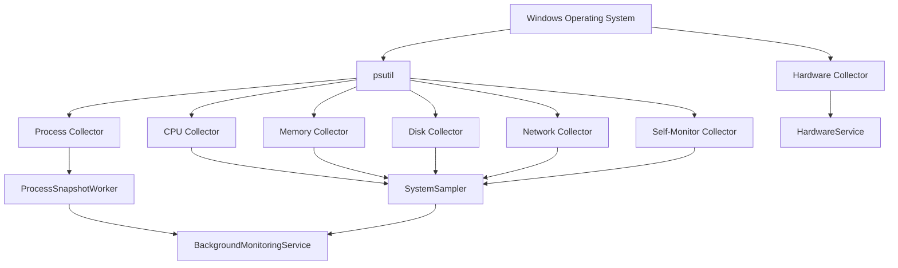
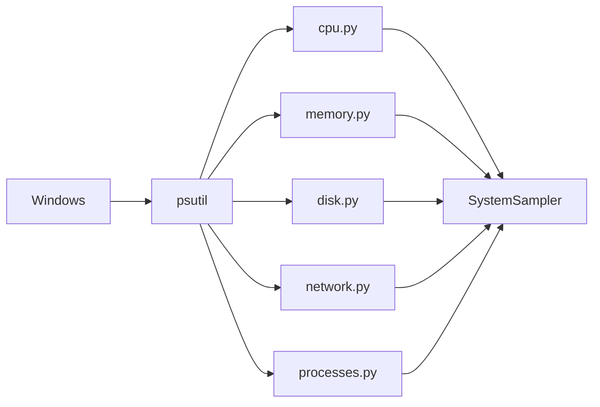

# System Collectors

The collectors are the lowest-level monitoring components in Sys Monitor.

Their responsibility is simple:

> Read raw system information from Windows and return it in a consistent Python-friendly format.

They do **not** decide how the data should be displayed, store historical samples, calculate long-term trends, or render anything to the terminal or web dashboard.

Those responsibilities belong to other parts of the application.

---

# Overview

The collectors live in:

```text
src/collectors/
```

Current collectors:

```text
collectors/
├── cpu.py
├── memory.py
├── disk.py
├── network.py
├── processes.py
└── self_monitor.py
```

Each collector focuses on one area of the operating system.



The collector layer can therefore be thought of as an **adapter** between Windows system information and the rest of the Python application.

---

# Why Use Collectors?

Without collectors, higher-level code could directly call psutil:

```python
psutil.cpu_percent()
psutil.virtual_memory()
psutil.disk_io_counters()
```

However, doing this throughout the application would tightly couple the application to psutil.

Instead, higher-level code asks our collector:

```python
cpu = get_cpu_usage()
```

The rest of the application does not need to know exactly how that value was obtained.

This gives us a useful separation:

```text
Windows-specific monitoring details
              ↓
         collectors
              ↓
standard data used by the application
```

This also gives us flexibility later.

For example, the CPU collector could eventually use:

* psutil
* Windows Performance Counters
* WMI
* native Win32 APIs
* Event Tracing for Windows

without requiring the dashboard to change.

---

# psutil

Sys Monitor currently uses the Python library **psutil**.

The name comes from:

```text
process
+
system
+
utilities
```

psutil provides a cross-platform Python interface for retrieving information about:

* CPU usage
* system memory
* disks
* network interfaces
* processes
* process CPU usage
* process memory
* process relationships
* system uptime
* many other operating-system statistics

Instead of directly working with low-level Windows APIs, we can write:

```python
import psutil

cpu = psutil.cpu_percent()
```

This makes psutil a useful abstraction layer.

Conceptually:

```text
Our Python code
      ↓
    psutil
      ↓
Operating-system APIs
      ↓
    Windows
```

psutil does not create the performance information itself.

It obtains information from facilities provided by the operating system and exposes it through a convenient Python API.

---

# CPU Collector

File:

```text
src/collectors/cpu.py
```

The CPU collector currently provides:

* total CPU utilisation
* utilisation per logical processor
* physical CPU core count
* logical processor count

Its result has a structure similar to:

```python
{
    "total_percent": 14.7,

    "per_cpu_percent": [
        8.2,
        14.0,
        23.4,
        4.1
    ],

    "physical_cores": 10,

    "logical_processors": 20,
}
```

---

# What Is a CPU?

CPU stands for:

**Central Processing Unit**

The CPU executes the instructions that make programs run.

Examples include:

```text
Python code
Browser JavaScript
Windows services
Games
Django
Discord
VS Code
```

All ultimately cause instructions to be executed by CPU cores.

A simplified flow is:

```text
Program
   ↓
Instructions
   ↓
Operating-system scheduler
   ↓
CPU
```

---

# Physical Cores

Modern CPUs contain multiple independent processing cores.

For example, the system currently being used for this project reports:

```text
10 physical cores
```

A simplified CPU might look like:

```text
CPU
├── Core 1
├── Core 2
├── Core 3
├── Core 4
├── Core 5
├── Core 6
├── Core 7
├── Core 8
├── Core 9
└── Core 10
```

Each physical core is capable of executing work.

Multiple cores allow the computer to perform multiple tasks in parallel.

---

# Logical Processors

Operating systems schedule work onto **logical processors**.

A physical core may expose more than one logical processor through technologies such as:

* Intel Hyper-Threading
* AMD Simultaneous Multithreading

For example:

```text
Physical Core 1
├── Logical CPU 0
└── Logical CPU 1
```

The current development PC reports:

```text
10 physical cores
20 logical processors
```

Windows therefore sees 20 CPU execution targets that can receive scheduled threads.

This distinction is important:

```text
Physical core
    =
hardware execution core

Logical processor
    =
CPU execution unit visible to the OS scheduler
```

---

# CPU Utilisation

CPU utilisation is usually displayed as a percentage.

Example:

```text
CPU Usage: 18%
```

This means approximately 18% of the computer's total CPU capacity was busy during the measured interval.

It does **not** mean that 18% of the CPU physically exists or that one specific core is running at 18%.

CPU usage is calculated over a period of time.

Conceptually:

```text
Time spent doing work
---------------------
Total measured time
```

For a multi-core system, the calculation considers available logical CPU capacity.

---

# CPU Sampling

The CPU collector uses:

```python
psutil.cpu_percent(interval=None)
```

for total usage.

It also uses:

```python
psutil.cpu_percent(
    interval=None,
    percpu=True
)
```

for per-logical-processor usage.

The `percpu=True` result looks similar to:

```python
[
    3.2,
    8.1,
    17.5,
    2.0,
    ...
]
```

Each value represents one logical processor.

---

# Why CPU Measurement Needs Priming

Non-blocking CPU measurement works by comparing CPU counters against a previous observation.

The first measurement has no useful previous observation.

Therefore the application first calls:

```python
psutil.cpu_percent(interval=None)
```

and ignores the result.

This establishes a baseline.

Conceptually:

```text
19:00:00
First measurement
      ↓
Store CPU counters
      ↓
wait
      ↓
19:00:01
Second measurement
      ↓
Compare against previous counters
      ↓
Calculate CPU utilisation
```

This initial baseline step is referred to in the project as **priming**.

---

# CPU Collector Data

The CPU collector currently returns:

## `total_percent`

Example:

```python
14.7
```

Total CPU utilisation for the machine.

---

## `per_cpu_percent`

Example:

```python
[
    4.1,
    18.6,
    7.2,
    32.5
]
```

One utilisation percentage for each logical processor.

This is now used by the dashboard to render one live utilisation bar for each logical processor.

---

## `physical_cores`

Example:

```python
10
```

Number of physical CPU cores.

---

## `logical_processors`

Example:

```python
20
```

Number of processors visible to the operating-system scheduler.

---

# Memory Collector

File:

```text
src/collectors/memory.py
```

The memory collector retrieves information about system RAM.

Current returned structure:

```python
{
    "percent": 47.9,
    "total": 34273824768,
    "available": 17828139008,
    "used": 16445685760,
    "free": 17828139008,
    "pagefile": {
        "total": ...,
        "used": ...,
        "free": ...,
        "percent": ...
    }
}
```

Physical-memory information comes from `psutil.virtual_memory()`. Page-file information is collected separately with `psutil.swap_memory()` and then stored in the same memory result for the dedicated Memory page.

Values representing quantities of memory are kept in **bytes**.

---

# What Is RAM?

RAM stands for:

**Random Access Memory**

RAM is the computer's fast working memory.

Programs that are currently running store data and code in memory so the CPU can access them quickly.

For example:

```text
Chrome
   ↓
RAM

VS Code
   ↓
RAM

Windows
   ↓
RAM

Python
   ↓
RAM
```

RAM is much faster than persistent storage such as an SSD.

However, unlike storage, RAM is generally volatile:

```text
Power off
   ↓
RAM contents disappear
```

---

# Total Memory

`total`

represents the total physical memory available to the operating system.

For example:

```text
31.92 GB
```

The collector stores the raw byte value:

```text
34,273,824,768 bytes
```

Conversion to GB happens later in the presentation layer.

---

# Used Memory

`used`

represents memory currently being used according to the operating system's memory accounting.

Example:

```text
15.3 GB used
```

Many different things consume memory:

* applications
* Windows
* drivers
* filesystem caches
* background services
* system processes

Memory management is more complicated than simply:

```text
Total RAM - Used RAM
```

because operating systems aggressively use unused RAM for caching.

---

# Available Memory

`available`

is particularly useful.

It estimates how much memory can be made available for new applications without requiring heavy swapping or paging.

For example:

```text
Total RAM:      31.92 GB
Available RAM:  16.62 GB
```

Available memory can include memory that is currently being used for caches but can quickly be reclaimed.

---

# Memory Percentage

`percent`

represents the system's current memory utilisation.

Example:

```text
47.9%
```

This is used by both the overview dashboard and the dedicated Memory page. The Memory page also calculates an explicit `in_use_bytes = total - available` value so its main breakdown matches the available-memory model used for the percentage.

---

# Page File

The memory collector also calls:

```python
psutil.swap_memory()
```

and records page-file capacity, used space, free space and percentage. On Windows, this is useful for showing how much page-file-backed capacity is currently in use.

The page file should not simply be thought of as "extra RAM". It participates in Windows virtual-memory and committed-memory management, while physical RAM remains much faster storage for actively used pages.

The dedicated Memory page displays this information separately from physical-memory utilisation.

---

# Why Collect Raw Bytes?

The collector intentionally does not convert memory to MB or GB.

It returns:

```python
16445685760
```

rather than:

```text
15.3 GB
```

This keeps **data collection separate from presentation**.

The same raw value could later be shown as:

```text
15.3 GB
15684 MB
16445685760 bytes
```

depending on what the frontend needs.

---

# Disk Collector

File:

```text
src/collectors/disk.py
```

The disk collector currently retrieves:

* storage capacity
* used storage
* free storage
* storage utilisation percentage
* cumulative bytes read
* cumulative bytes written

Example result:

```python
{
    "percent": 92.4,

    "total": 998848331776,

    "used": 922745000000,

    "free": 76103331776,

    "read_bytes": 481234567890,

    "write_bytes": 298765432100,
}
```

---

# What Is a Disk?

In this project, "disk" currently refers to persistent storage.

On the development system this is likely an SSD.

Persistent storage is used for things such as:

```text
Windows
Applications
Games
Documents
Databases
Python files
Photos
Videos
```

Unlike RAM:

```text
Power off
    ↓
Disk data remains
```

---

# Disk Capacity vs Disk Activity

An important distinction is:

```text
Disk capacity
≠
Disk activity
```

For example:

```text
Disk Usage: 92.4%
```

currently means:

> 92.4% of the C: drive's storage capacity is occupied.

It does **not** mean the SSD is currently 92.4% busy.

Windows Task Manager may show something like:

```text
Disk 42%
```

which typically refers to activity or utilisation of the storage device.

These are different metrics.

---

# Disk Capacity

The collector uses:

```python
psutil.disk_usage("C:\\")
```

to obtain:

```text
total
used
free
percent
```

Current live capacity monitoring is limited to the Windows `C:` drive.

The dedicated Disk page combines this live filesystem view with **physical-drive identity** from the static hardware collector. This is why the page can show both C: capacity and information such as an SSD's model, NVMe bus type, physical capacity and health.

These are deliberately treated as different concepts:

```text
filesystem / volume
    → used and free capacity

physical drive
    → actual storage hardware
```

Future versions may enumerate all volumes and calculate live activity per physical device.

---

# Disk I/O

I/O stands for:

**Input / Output**

For a disk:

```text
Read
    =
data travelling from disk to the computer

Write
    =
data travelling from the computer to disk
```

Examples:

```text
Opening a large file
        ↓
disk read

Saving a video
        ↓
disk write

Installing a game
        ↓
many disk writes

Starting an application
        ↓
many disk reads
```

---

# Disk I/O Counters

The collector uses:

```python
psutil.disk_io_counters()
```

and currently stores:

```text
read_bytes
write_bytes
```

These are **cumulative counters**.

For example:

```text
At 20:00:00
read_bytes = 500,000,000,000

At 20:00:01
read_bytes = 510,000,000,000
```

The difference is:

```text
10,000,000,000 bytes
```

Therefore approximately 10 GB was read during that interval.

The disk collector itself does not calculate the speed.

That calculation belongs to `SystemSampler`.

---

# Why Use Cumulative Counters?

Operating systems commonly expose performance data as continuously increasing counters.

This has several advantages.

The monitoring application can choose its own sampling frequency:

```text
100 ms
1 second
5 seconds
1 minute
```

The rate can then be calculated as:

```text
new counter - previous counter
------------------------------
elapsed time
```

This same pattern is used for both:

* disk throughput
* network throughput

---

# Network Collector

File:

```text
src/collectors/network.py
```

The network collector retrieves:

```python
{
    "bytes_sent": ...,
    "bytes_received": ...,
    "packets_sent": ...,
    "packets_received": ...,
}
```

---

# What Is a Computer Network?

A network allows computers and devices to exchange data.

Typical communication from this PC might look like:

```text
Application
    ↓
Windows networking stack
    ↓
Wi-Fi / Ethernet adapter
    ↓
Router
    ↓
Internet
    ↓
Remote server
```

Examples:

```text
Chrome
    ↓
web server

Steam
    ↓
game download server

Discord
    ↓
Discord servers
```

---

# Bytes Sent

`bytes_sent`

is the cumulative amount of network data transmitted by the computer.

Example activities:

```text
uploading a file
sending an HTTP request
sending voice data
sending game traffic
```

---

# Bytes Received

`bytes_received`

is the cumulative amount of network data received by the computer.

Example:

```text
downloading a game
loading a website
streaming video
receiving software updates
```

---

# Packets

Network communication is divided into units called **packets**.

Instead of sending one enormous continuous block:

```text
1 GB file
```

the networking stack transfers many smaller units:

```text
packet
packet
packet
packet
...
```

The collector currently retrieves:

```text
packets_sent
packets_received
```

These are not yet displayed in the dashboard, but retaining them gives us useful information for future network analysis.

---

# Network Speed

Just like disk I/O, network byte counters are cumulative.

For example:

```text
Sample A

bytes_received =
2,000,000,000
```

one second later:

```text
Sample B

bytes_received =
2,010,000,000
```

Difference:

```text
10,000,000 bytes
```

Over approximately one second:

```text
10 MB/s
```

This calculation happens in `SystemSampler`, not inside the collector.

---

# Per-Interface Network Monitoring

The Network collector now uses:

```python
psutil.net_io_counters(pernic=True)
```

to retrieve cumulative sent/received byte counters for each network interface. `SystemSampler` compares consecutive values to calculate per-interface download and upload rates.

The collector also uses:

```python
psutil.net_if_addrs()
psutil.net_if_stats()
```

to describe each adapter. The current interface model can include:

```text
name
is_up
speed_mbps
mtu
duplex
addresses[]
    ├── IPv4
    ├── IPv6
    └── MAC
```

This lets the Network page distinguish adapters such as Ethernet, Wi-Fi, loopback, VPN and virtual interfaces instead of treating networking as one anonymous total.

---

# Network Connections / Sockets

The collector now calls:

```python
psutil.net_connections(kind="inet")
```

to obtain current IPv4/IPv6 TCP and UDP sockets. Each returned connection is normalised into data such as:

```text
pid
process_name
protocol       TCP / UDP
family         IPv4 / IPv6
local          IP + port
remote         IP + port, when present
status         ESTABLISHED / LISTEN / ...
```

A socket is a networking endpoint used by a process. A TCP connection can have states such as `LISTEN`, `SYN_SENT`, `ESTABLISHED` and `TIME_WAIT`. UDP does not establish a TCP-style connection and may therefore have no remote endpoint or meaningful TCP connection state.

---

# Mapping Connections to Processes

`SystemSampler` already collects the current process list. It creates a small lookup:

```text
PID → process name
```

and passes that lookup into the network connection collector. This avoids enumerating every process a second time just to label sockets.

Conceptually:

```text
Process collector
      ↓
complete process snapshot
      ↓
PID → name map
      ↓
network socket PID
      ↓
chrome.exe / python.exe / svchost.exe / ...
```

---

# Connection Inspection vs Packet Capture

The current collector observes **socket/connection state**, not individual packets or application payloads. It can answer questions such as:

```text
Which process owns this socket?
What local port is it using?
What remote IP/port is connected?
Is the TCP socket established or listening?
```

but it does not currently show:

```text
individual packet contents
HTTP request/response bodies
TLS plaintext
per-packet timing and headers
```

Packet capture is intentionally reserved for a later Network iteration using a dedicated capture worker rather than the one-second system sampler.

---

# Self-Monitor Collector

File:

```text
src/collectors/self_monitor.py
```

`SelfMonitorCollector` measures the resource cost of the Python process that is running the Sys Monitor backend itself.

It is intentionally implemented as a **stateful class** rather than a stateless function because process CPU percentage and process I/O rates require earlier observations.

Conceptually:

```text
Sys Monitor Python process
        │
        ├── CPU time
        ├── resident / working-set memory
        ├── cumulative process I/O counters
        ├── threads
        ├── Windows handles
        └── process lifetime
        │
        ▼
SelfMonitorCollector
        │
        ▼
self_monitor sample
```

The collector owns a `psutil.Process` for:

```python
psutil.Process(os.getpid())
```

so it measures the currently running Python/Django backend process.

## CPU

`Process.cpu_percent(interval=None)` is primed once and then sampled non-blockingly. Psutil process CPU can exceed `100%` when a process uses more than one logical CPU, so Sys Monitor retains the raw value and also normalises it by the machine's logical-processor count:

```text
raw process CPU
        ÷
logical processor count
        ↓
approximate whole-machine CPU share
```

This makes the self-overhead CPU number comparable to the normalised process CPU percentages already used elsewhere in the project.

## Memory

The collector uses the process RSS / resident memory value and reports `memory_bytes` and `memory_percent`. On Windows this is closely related to the process working set: memory currently resident in physical RAM for the process.

## Process I/O

`Process.io_counters()` returns cumulative process I/O counters. The collector stores the previous values and converts the deltas into rates:

```text
current read_bytes - previous read_bytes
────────────────────────────────────────
elapsed seconds

= read bytes / second
```

The same calculation is used for writes. These values are labelled **Read I/O** and **Write I/O** rather than physical-disk throughput because operating-system caching means process I/O counters do not necessarily equal direct SSD activity.

## Other Process Metadata

The collector also reports thread count, Windows handle count when available, recursive child-process count and process uptime.

Socket counts are not collected by running another network query. `SystemSampler` reuses the socket list already collected for the Network page and counts the rows whose PID matches the Sys Monitor process.

## Sampling Duration

`SystemSampler` measures the wall-clock time taken by one complete monitoring cycle with `time.perf_counter()` and stores it as `sample_duration_ms` in the self-monitor section.

This is useful for understanding how long a collection pass takes, but it is **not identical to CPU percentage**. A sample can include kernel work, waiting and other non-CPU time.

## Scope

The current collector measures the main Python/Django backend process. It does not include browser rendering cost from Chrome, Chart.js or Cytoscape. Child-process count is currently informational; child resource usage is not aggregated into the main CPU/RAM/I/O values.

---

# Process Collector

File:

```text
src/collectors/processes.py
```

The process collector is more complicated than the other collectors because Windows may have hundreds of processes running simultaneously.

The collector itself still has one responsibility: enumerate accessible Windows processes and return process data. Profiling showed that requesting data for hundreds of processes can take around 1.5 seconds on the development PC.

For that reason, `get_processes()` is no longer called directly inside the fast one-second `SystemSampler`. It is executed by:

```text
src/monitoring/process_worker.py
```

The `ProcessSnapshotWorker` refreshes process information independently and exposes a cached snapshot to `BackgroundMonitoringService`.

```text
processes.py
    ↓
expensive process enumeration
    ↓
ProcessSnapshotWorker
    ↓
cached process snapshot
    ↓
BackgroundMonitoringService
    ↓
Overview / Processes / Memory / Network
```

This keeps the collector simple while moving its expensive execution off the critical system-sampling path.

Current process information includes:

```python
{
    "pid": ...,
    "ppid": ...,
    "name": ...,
    "cpu_percent_raw": ...,
    "cpu_percent": ...,
    "memory_bytes": ...,
}
```

---

# What Is a Process?

A process is a running instance of a program.

For example:

```text
chrome.exe
Code.exe
python.exe
Discord.exe
steam.exe
```

A program stored on disk is not necessarily a running process.

Example:

```text
python.exe stored on disk
        ↓
user launches Python
        ↓
Windows creates a process
```

The operating system gives that process resources such as:

* memory
* CPU time
* handles
* threads
* virtual address space
* security information

---

# Program vs Process

These concepts are related but different.

```text
Program
    =
instructions stored on disk

Process
    =
a running instance of those instructions
```

The same program may have several processes.

Chrome is a good example:

```text
chrome.exe
chrome.exe
chrome.exe
chrome.exe
chrome.exe
```

All use the same program executable but are separate running processes.

---

# PID

PID means:

**Process Identifier**

Every running process receives an ID from the operating system.

Example:

```text
chrome.exe
PID 17420
```

Another Chrome process might have:

```text
chrome.exe
PID 18312
```

The name may be identical, but the PIDs distinguish the processes.

---

# PPID

PPID means:

**Parent Process Identifier**

Processes can create other processes.

Example:

```text
explorer.exe
PID 4000
    │
    └── chrome.exe
        PID 10000
        PPID 4000
```

The child process records the PID of its parent.

This allows us to construct process trees.

---

# Process Trees

A process tree visualises parent/child relationships.

For example:

```text
explorer.exe
│
├── chrome.exe
│   ├── chrome.exe
│   ├── chrome.exe
│   └── chrome.exe
│
├── Code.exe
│   ├── node.exe
│   └── python.exe
│
└── Discord.exe
```

The project already contains:

```text
src/process_tree.py
```

which is used to experiment with this concept.

The dedicated Processes page now uses `pid` and `ppid` to build an expandable parent/child process tree in JavaScript.

---

# Why Chrome Uses Many Processes

Chrome uses a multi-process architecture.

Instead of:

```text
Chrome
└── one enormous process
```

it commonly has:

```text
Chrome browser process
│
├── renderer
├── renderer
├── GPU process
├── utility process
├── network-related process
└── other child processes
```

Reasons for this architecture include:

* security isolation
* stability
* sandboxing
* fault containment
* parallel execution

This is why Windows Task Manager often shows many `chrome.exe` entries.

It is not simply one process for every browser tab.

The relationship between tabs, websites and renderer processes can be more complex.

---

# Enumerating Processes

The collector uses:

```python
psutil.process_iter(...)
```

to iterate through running processes.

A simplified version looks like:

```python
for process in psutil.process_iter(
    ["pid", "ppid", "name"]
):
    print(process.info)
```

One challenge is that processes are constantly changing.

For example:

```text
collector sees process PID 1000

process exits

collector attempts to read PID 1000
```

The process may no longer exist.

Therefore process monitoring needs to expect errors such as:

```text
NoSuchProcess
AccessDenied
```

The collector catches these errors and continues rather than crashing the entire monitor.

---

# Process CPU Usage

Each process can consume CPU time.

Examples:

```text
Chrome       4.2%
VS Code      2.0%
Discord      0.8%
```

The process collector uses:

```python
process.cpu_percent(
    interval=None
)
```

Like system CPU measurement, process CPU utilisation needs an earlier observation.

Therefore existing processes are primed before useful CPU measurements are collected.

---

# Raw psutil Process CPU %

psutil's process CPU percentage is based around logical CPU capacity.

A process fully occupying one logical processor may report approximately:

```text
100%
```

A highly parallel process may exceed 100%.

For example:

```text
200%
400%
800%
```

This can initially look strange.

It means the process used the equivalent capacity of multiple logical processors.

---

# Task Manager-Style CPU %

Windows Task Manager normally presents process CPU usage relative to the entire machine.

For example, this system has:

```text
20 logical processors
```

One fully occupied logical processor represents approximately:

```text
100 / 20
=
5%
```

of the machine's total CPU capacity.

The process collector therefore keeps two CPU values:

```python
"cpu_percent_raw"
```

and:

```python
"cpu_percent"
```

The second value is normalised to behave more like the percentage users expect from Windows Task Manager.

Conceptually:

```text
psutil raw CPU
      ↓
divide by logical CPU count
      ↓
Task Manager-style percentage
```

Keeping both values allows the project to teach both measurement styles later.

---

# Process Memory

Each process also consumes memory.

The collector currently uses process resident memory information.

This is stored as:

```python
"memory_bytes"
```

Example:

```text
chrome.exe
823 MB
```

The raw collector still stores bytes.

The terminal or web frontend converts those bytes into MB or GB.

---

# RSS / Working Set

A common memory measurement is:

**RSS — Resident Set Size**

Broadly, this represents memory belonging to the process that is currently resident in physical RAM.

On Windows this corresponds closely to the idea of a process **working set**.

For example:

```text
Process
    │
    ├── virtual memory
    │
    ├── memory mapped files
    │
    └── pages currently in physical RAM
              ↑
          working set
```

Memory accounting is a complex topic and will be explored further as the process monitor becomes more advanced.

---

# Top CPU Processes

The process collector provides:

```python
get_top_cpu_processes()
```

It sorts all collected processes by CPU usage.

Example:

```text
chrome.exe        5.2%
Code.exe          2.1%
Discord.exe       1.3%
MsMpEng.exe       0.8%
python.exe        0.4%
```

This is now displayed in the dashboard's Top CPU Processes table.

---

# Top Memory Processes

The process collector also provides:

```python
get_top_memory_processes()
```

This sorts running processes by memory usage.

Example:

```text
chrome.exe        820 MB
Code.exe          640 MB
Discord.exe       370 MB
Steam             290 MB
python.exe         110 MB
```

This is now displayed in the dashboard's Top Memory Processes table.

---


# Hardware Collector

File:

```text
src/collectors/hardware.py
```

The hardware collector is different from the live psutil collectors. It retrieves **static or slow-changing hardware identity data** from Windows using PowerShell/CIM queries and `Get-PhysicalDisk`.

It currently discovers:

- CPU model, manufacturer, core counts, reported clock and cache sizes
- GPU model, driver and Windows-reported adapter memory
- physical RAM modules, slots, capacities and speeds
- physical disks, media type, bus type, size and health
- system manufacturer/model and architecture
- motherboard information
- BIOS/firmware information

Conceptually:

```text
Python
   ↓
PowerShell
   ↓
Windows CIM / storage interfaces
   ↓
JSON
   ↓
hardware.py
```

Unlike CPU, disk or network activity, these values do not need to be sampled once per second. `HardwareService` collects them on demand and caches the result.

## Raw Hardware Data vs Normalised Hardware Data

Windows property names such as `NumberOfLogicalProcessors`, `ConfiguredClockSpeed` and `SMBIOSBIOSVersion` are converted by `hardware/normalizer.py` into application-friendly names such as:

```text
logical_processors
configured_speed_mt_s
version
```

The normalizer also cleans placeholder firmware values such as blank part numbers or `0000` manufacturers.

## Hardware Reporting Limitations

Hardware metadata depends on firmware, drivers and the Windows interface being queried. A value being available does not guarantee that it is perfectly authoritative.

For example, the GPU field is intentionally named:

```text
reported_vram_bytes
```

rather than simply `vram_bytes`, because Windows graphics interfaces may report adapter-memory values imperfectly on some modern GPUs. The frontend preserves this uncertainty by labelling the value as **Windows-reported VRAM**.

---
# Collector Responsibilities

The collector layer should remain relatively simple.

Collectors should:

* retrieve system data
* handle operating-system access errors
* return predictable structures
* avoid presentation logic
* avoid database logic
* avoid HTTP logic

Collectors should **not**:

* print dashboard output
* draw charts
* create HTML
* store historical data
* calculate long-term analytics
* communicate directly with JavaScript

---

# Collector Data Flow

The current data flow is:



Another way to view the separation is:

```text
                   RAW SYSTEM DATA
                          │
                          ▼
                    COLLECTORS
                          │
            standard Python dictionaries
                          │
                          ▼
                    SYSTEM SAMPLER
                          │
              calculated system sample
                          │
                          ▼
               APPLICATION LAYERS
```

---

# Why the Collector Layer Matters

This architecture allows the rest of the project to ask simple questions:

```python
cpu = get_cpu_usage()
memory = get_memory_usage()
disk = get_disk_usage()
```

without needing to understand:

* Windows APIs
* cumulative counters
* process permission errors
* CPU enumeration
* psutil implementation details

It provides an abstraction boundary.

This is a common software-engineering principle:

> Hide implementation details behind a small, predictable interface.

---

# Current Collector Limitations

The collector layer is intentionally still simple.

Current limitations include:

## CPU

* no CPU clock-speed monitoring
* no temperature monitoring
* no interrupt monitoring
* no context-switch monitoring
* no kernel/user CPU split in the dashboard

## Memory

* page-file capacity/usage is displayed, but no detailed Windows standby/cache breakdown
* no committed-memory or paged/non-paged pool breakdown
* no page-fault or paging-rate monitoring
* no per-memory-category visualisation beyond in-use/available

## Disk

* live capacity still focuses on the C: filesystem
* physical-drive identity is available, but live throughput is not yet separated per drive
* no queue depth
* no latency
* no response-time monitoring
* no active-time percentage
* no per-process disk usage

## Network

* per-interface rates, addresses and adapter state are available, but no Wi-Fi signal/channel information
* current Network monitoring intentionally remains at socket/connection level; packet capture is outside the current scope
* no direct per-process byte-throughput attribution
* some PID/connection details can be unavailable because of OS permissions or short-lived sockets
* reverse-DNS names are enrichment data and may not resolve

## Processes

* full process enumeration is relatively expensive on Windows and therefore refreshes independently from the one-second system sample
* cached process information can be slightly older than the newest CPU/RAM/disk/network sample
* no thread information
* no handle counts
* no executable path in the dashboard
* no user/owner information
* no process start time
* no per-process disk I/O
* no per-process network activity
* no process command-line display in the main dashboard

These are potential future areas of development.

---

# Planned Collector Development

Potential future collector expansion:

```text
collectors/
│
├── cpu.py
├── memory.py
├── disk.py
├── network.py
├── processes.py
├── hardware.py          # current static hardware identity
├── self_monitor.py       # current backend overhead collector
│
├── gpu.py               # possible live GPU metrics
├── services.py
└── connections.py
```

Possible metrics include:

* CPU frequencies
* CPU context switches
* CPU interrupts
* GPU utilisation
* GPU memory
* temperatures
* Windows services
* packet capture / protocol decoding
* Wi-Fi signal and channel information
* per-process network byte attribution
* disk latency
* disk queue depth
* system boot time
* logged-in users
* process threads
* process handles

---

# Learning Concepts Covered by the Collectors

The collector layer already introduces several important computer-science concepts:

```text
CPU
├── cores
├── logical processors
├── scheduling
└── utilisation

Memory
├── RAM
├── available memory
├── working sets
└── resident memory

Disk
├── persistent storage
├── reads
├── writes
└── I/O counters

Network
├── bytes and cumulative counters
├── interfaces and adapters
├── IPv4 / IPv6 / MAC addresses
├── sockets
├── TCP / UDP
├── ports and connection state
└── sending / receiving

Processes
├── process
├── PID
├── PPID
├── parent/child relationships
├── CPU time
└── process memory
```

These concepts will later be expanded in:

```text
docs/concepts.md
```

---

# Summary

The collector layer is responsible for answering the question:

> What is Windows doing right now?

It obtains raw system information using psutil and exposes that information to the rest of the application through small Python functions.

The collectors do not decide what the information means over time.

That is the responsibility of the monitoring layer.

The next layer is:

```text
src/monitoring/
├── sampler.py
└── history.py
```

which takes the raw values provided by the collectors and turns them into meaningful time-based system samples.
