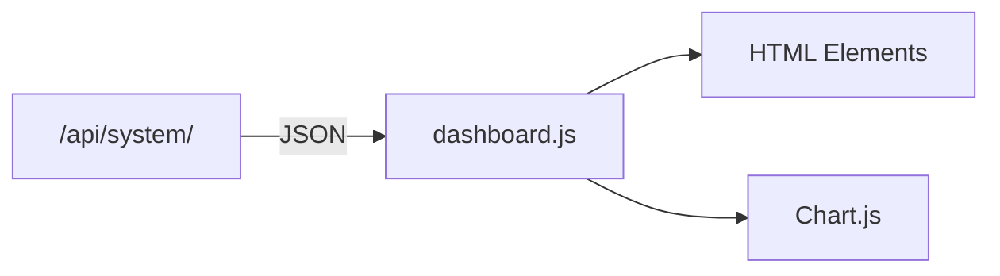
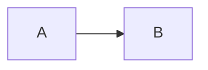
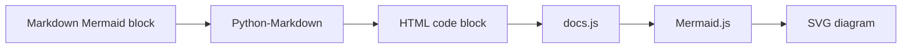
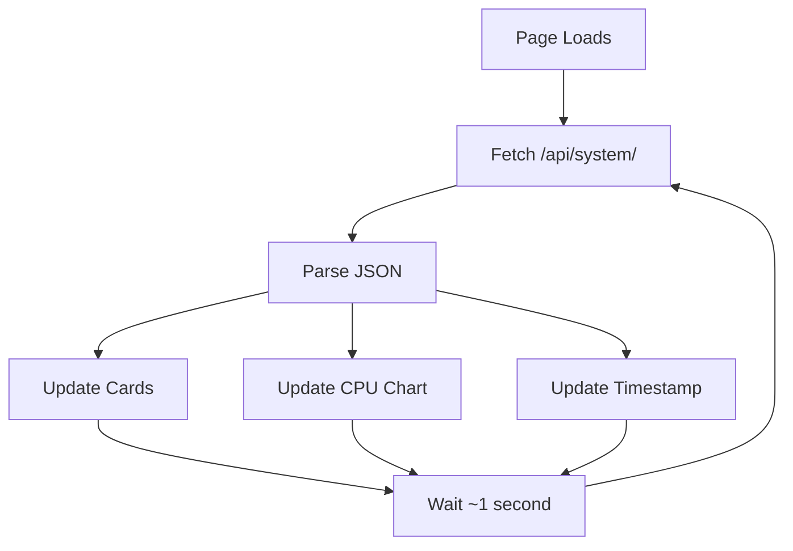
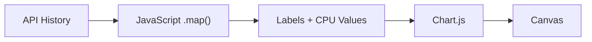
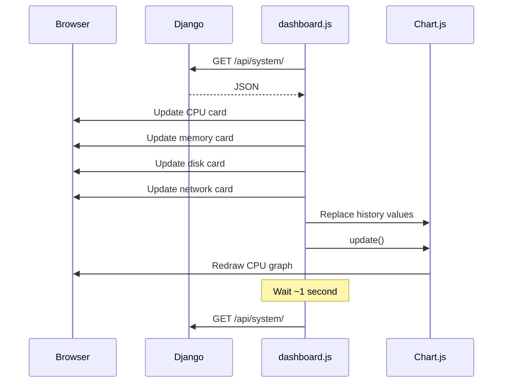
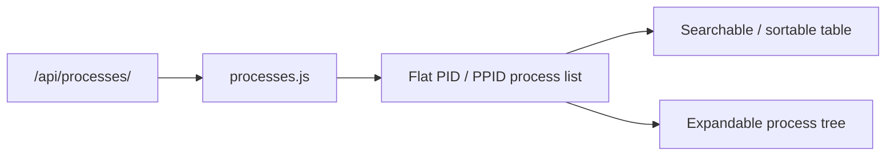
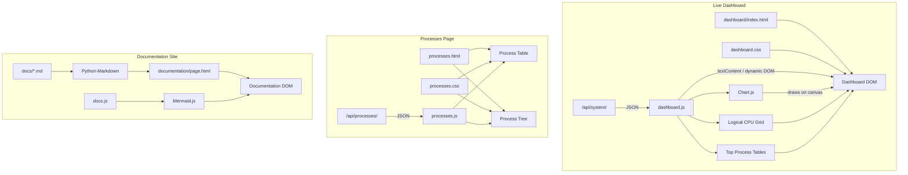

# Frontend

The Sys Monitor frontend is responsible for displaying monitoring data in the browser.

It currently uses:

* Django templates
* HTML
* CSS
* JavaScript
* Chart.js

The frontend does **not** collect system information itself.

Instead, it requests monitoring data from the Django backend through:

```text
GET /api/system/
```

and turns the returned JSON into a live dashboard.

---

# Frontend Overview

The current frontend flow is:



The responsibilities are separated:

```text
HTML
    ↓
page structure

CSS
    ↓
page appearance

JavaScript
    ↓
live behaviour

Chart.js
    ↓
graph rendering
```

---

# Frontend Files

The current frontend lives inside the Django `dashboard` application:

```text
src/dashboard/
│
├── templates/
│   └── dashboard/
│       ├── index.html
│       └── processes.html
│
└── static/
    └── dashboard/
        ├── css/
        │   ├── dashboard.css
        │   └── processes.css
        │
        └── js/
            ├── dashboard.js
            └── processes.js
```

---

# Documentation Frontend

The project now also contains a separate Django application for technical documentation:

```text
src/documentation/
├── views.py
├── urls.py
├── templates/
│   └── documentation/
│       ├── base.html
│       ├── index.html
│       └── page.html
└── static/
    └── documentation/
        ├── css/
        │   └── docs.css
        └── js/
            └── docs.js
```

Unlike the live dashboard, the documentation pages do not retrieve monitoring JSON every second. Their job is to turn the Markdown files in the project's top-level `docs/` directory into readable web pages.

The Markdown files remain the **source of truth**:

```text
docs/architecture.md
        ↓
Python-Markdown
        ↓
HTML
        ↓
Django template
        ↓
Browser
```

This avoids maintaining one copy of the documentation in Markdown and another copy manually written in HTML.

## Python-Markdown Rendering

The documentation view reads the selected `.md` file as ordinary text:

```python
markdown_text = markdown_path.read_text(
    encoding="utf-8"
)
```

The Python `markdown` package then converts Markdown syntax into HTML:

```python
renderer = markdown.Markdown(
    extensions=[
        "extra",
        "toc",
        "sane_lists",
    ]
)

content_html = renderer.convert(
    markdown_text
)
```

For example:

```markdown
# CPU

**CPU** means Central Processing Unit.
```

becomes HTML similar to:

```html
<h1>CPU</h1>
<p><strong>CPU</strong> means Central Processing Unit.</p>
```

The generated HTML is passed to the generic documentation template as `content_html`.

Because this HTML comes from trusted Markdown files maintained inside the project, the template renders it using:

```django
{{ content_html|safe }}
```

Normally Django escapes HTML. The `safe` filter tells Django that this already-generated HTML should be rendered instead of displayed as literal `<h1>`, `<p>`, and other tags.

This should **not** be used blindly for untrusted user-submitted Markdown without sanitising it first.

## One Generic Page Template

All documentation topics use the same template:

```text
documentation/page.html
```

The selected page title, description, rendered Markdown and table of contents are passed into that template by the view.

This means there is no need for separate templates such as:

```text
collectors.html
monitoring.html
architecture.html
api.html
```

The content changes while the layout remains reusable.

## Mermaid Diagram Rendering

Python-Markdown converts a fenced Mermaid block into an HTML code block, but it does **not** itself draw the diagram.

For example:

````markdown

````

first becomes HTML approximately like:

```html
<pre>
    <code class="language-mermaid">
        flowchart LR
        A --> B
    </code>
</pre>
```

Then `documentation/js/docs.js` runs in the browser.

It:

1. Finds code blocks with the `language-mermaid` class.
2. Changes them into elements Mermaid understands.
3. Loads the Mermaid JavaScript library.
4. Asks Mermaid to parse the diagram text.
5. Mermaid generates an SVG diagram in the page.



Therefore two separate renderers are involved:

```text
Python-Markdown
    ↓
renders Markdown as HTML

Mermaid.js
    ↓
renders Mermaid diagram text as graphics
```

---

# Django Template

The main dashboard page is:

```text
src/dashboard/templates/dashboard/index.html
```

Django renders this when the browser requests:

```text
/
```

The view is:

```python
def index(request):
    return render(
        request,
        "dashboard/index.html",
    )
```

The HTML page is loaded once.

After that, JavaScript updates the monitoring values dynamically without reloading the entire page.

---

# Static Files

Django static files are used for:

* CSS
* JavaScript
* future images/icons

At the top of the template:

```django

```

allows Django to generate static-file URLs.

For example:

```html
<link
    rel="stylesheet"
    href=""
>
```

loads the dashboard CSS.

Similarly:

```html
<script
    src=""
></script>
```

loads the dashboard JavaScript.

---

# HTML Structure

The current dashboard contains:

```text
Dashboard
│
├── Header
│   ├── title
│   └── LIVE indicator
│
├── Metric Cards
│   ├── CPU
│   ├── Memory
│   ├── Disk
│   └── Network
│
├── CPU History Chart
│
├── Logical Processor Activity
│   └── one live utilisation bar per logical CPU
│
├── Process Tables
│   ├── Top CPU Processes
│   └── Top Memory Processes
│
└── Last Updated information
```

The metric cards initially contain placeholder values such as:

```html
<strong id="cpu-value">
    --%
</strong>
```

JavaScript later replaces the placeholder with live data.

---

# Element IDs

HTML element IDs give JavaScript a way to find specific parts of the page.

For example:

```html
<strong id="cpu-value">
    --%
</strong>
```

JavaScript retrieves it using:

```javascript
const cpuValue =
    document.getElementById("cpu-value");
```

`cpuValue` now refers to that HTML element.

The frontend does the same for:

```text
cpu-value
memory-value
memory-detail
disk-value
disk-detail
network-value
network-detail
sample-count
last-updated
```

---

# DOM

The browser represents the HTML page as a structure called the **DOM**.

DOM stands for:

**Document Object Model**

A simplified page might be represented as:

```text
Document
│
└── body
    │
    └── main
        │
        ├── CPU card
        ├── Memory card
        ├── Disk card
        └── Network card
```

JavaScript can access and modify these elements.

For example:

```javascript
cpuValue.textContent = "14.7%";
```

changes the text displayed inside the CPU element.

Conceptually:

```text
HTML element
    ↓
JavaScript reference
    ↓
change textContent
    ↓
browser redraws element
```

---


# Dynamic DOM Generation

The logical-processor grid and process tables are generated from API data rather than being hard-coded in HTML.

For example, `cpu.per_cpu_percent` is an array containing one percentage for each logical processor. JavaScript loops through the array and creates a DOM element for every entry:

```text
API array
   ↓
forEach()
   ↓
createElement()
   ↓
appendChild()
   ↓
CPU 0, CPU 1, CPU 2, ...
```

This makes the UI **data-driven**: a PC with 8 logical processors creates 8 items, while a PC with 20 creates 20.

The Top CPU and Top Memory tables use the same pattern. Each process object returned by the API becomes one table row.

---

# `dashboard.js`

The main frontend behaviour lives in:

```text
src/dashboard/static/dashboard/js/dashboard.js
```

Its main responsibilities are:

1. Request monitoring data.
2. Parse the JSON response.
3. Update dashboard cards.
4. Format raw values.
5. Update the CPU chart.
6. Build the logical-processor utilisation grid.
7. Build the Top CPU and Top Memory process tables.
8. Repeat the process.

---

# Main Frontend Loop

The current frontend behaves approximately like this:



This is what creates the live-dashboard effect.

---

# Fetching Data

The main request is:

```javascript
const response =
    await fetch("/api/system/");
```

`fetch()` sends an HTTP request from the browser to Django.

The browser requests:

```text
GET /api/system/
```

Django returns JSON.

---

# `async` and `await`

The function is declared:

```javascript
async function fetchSystemData() {
```

because an HTTP request takes time.

JavaScript should not freeze the entire page while waiting for Django.

This:

```javascript
await fetch("/api/system/");
```

means approximately:

> Wait for this request to finish before continuing this function.

Other browser activity can continue while the request is in progress.

---

# Parsing JSON

After receiving the HTTP response:

```javascript
const data =
    await response.json();
```

converts the response body into a JavaScript object.

For example, JSON such as:

```json
{
    "cpu": {
        "percent": 14.7
    }
}
```

becomes accessible as:

```javascript
data.cpu.percent
```

which returns:

```text
14.7
```

---

# Updating Metric Cards

Once the data is available:

```javascript
updateCards(data);
```

updates the main resource cards.

For example:

```javascript
cpuValue.textContent =
    `${data.cpu.percent.toFixed(1)}%`;
```

If the API returns:

```text
14.7328
```

then:

```javascript
.toFixed(1)
```

produces:

```text
14.7
```

and the template string adds:

```text
%
```

The page therefore displays:

```text
14.7%
```

---

# Template Strings

JavaScript uses template strings such as:

```javascript
`${data.cpu.percent.toFixed(1)}%`
```

Template strings are surrounded by:

```text
`
```

backticks.

Values can be inserted using:

```javascript
${...}
```

Example:

```javascript
const name = "CPU";

const text = `${name} Usage`;
```

produces:

```text
CPU Usage
```

---

# Formatting Bytes

The backend returns raw byte values.

The frontend contains helper functions:

```javascript
function bytesToGB(bytes) {
    return bytes / (1024 ** 3);
}
```

and:

```javascript
function bytesToMB(bytes) {
    return bytes / (1024 ** 2);
}
```

This means the backend might return:

```text
16445685760 bytes
```

while the dashboard displays:

```text
15.3 GB
```

This keeps measurement separate from presentation.

---

# Memory Display

The frontend can combine several API values.

For example:

```javascript
memoryDetail.textContent =
    `${bytesToGB(
        data.memory.used_bytes
    ).toFixed(1)} GB used / `
    +
    `${bytesToGB(
        data.memory.total_bytes
    ).toFixed(1)} GB`;
```

This produces output similar to:

```text
15.3 GB used / 31.9 GB
```

---

# Disk Display

The disk card displays two different ideas:

```text
Disk capacity
Disk activity
```

The main value:

```javascript
data.disk.percent
```

shows how full the disk is.

The detail section uses:

```javascript
data.disk.read_bytes_per_second
```

and:

```javascript
data.disk.write_bytes_per_second
```

to display activity such as:

```text
Read 4.31 MB/s • Write 1.25 MB/s
```

---

# Network Display

The network card uses:

```javascript
data.network.download_bytes_per_second
```

and:

```javascript
data.network.upload_bytes_per_second
```

to display:

```text
↓ 3.42 MB/s
↑ 0.18 MB/s
```

The arrows provide a simple visual distinction between incoming and outgoing traffic.

---

# Chart.js

Chart.js is used for the current CPU history graph.

It is loaded in the HTML page:

```html
<script
    src="https://cdn.jsdelivr.net/npm/chart.js@4.5.1/dist/chart.umd.min.js"
></script>
```

This makes the JavaScript `Chart` object available.

---

# Canvas

The HTML contains:

```html
<canvas id="cpu-chart"></canvas>
```

A canvas is an area where JavaScript can draw graphics.

Chart.js takes control of this canvas and draws the CPU graph.

---

# Creating the Chart

The chart is created once:

```javascript
const cpuChart = new Chart(
    document.getElementById("cpu-chart"),
    {
        type: "line",
        ...
    }
);
```

The important parts are:

```text
type
    ↓
line chart

labels
    ↓
timestamps

dataset
    ↓
CPU percentages
```

---

# Chart Data

Conceptually, Chart.js needs two related arrays.

Labels:

```javascript
[
    "21:30:01",
    "21:30:02",
    "21:30:03"
]
```

Values:

```javascript
[
    8.2,
    14.7,
    21.5
]
```

The chart pairs them:

```text
21:30:01 → 8.2%
21:30:02 → 14.7%
21:30:03 → 21.5%
```

and draws the line.

---

# History from the API

The API sends history similar to:

```json
[
    {
        "timestamp": "...",
        "cpu_percent": 8.2
    },
    {
        "timestamp": "...",
        "cpu_percent": 14.7
    }
]
```

The frontend converts these objects into the arrays Chart.js needs.

---

# JavaScript `.map()`

The code uses:

```javascript
history.map(...)
```

`.map()` creates a new array by transforming every item in an existing array.

For example:

```javascript
const values = [
    { cpu: 10 },
    { cpu: 20 },
    { cpu: 30 }
];

const cpuValues =
    values.map(
        item => item.cpu
    );
```

produces:

```javascript
[
    10,
    20,
    30
]
```

---

# Building Chart Values

CPU percentages are extracted using:

```javascript
cpuChart.data.datasets[0].data =
    history.map(
        sample => sample.cpu_percent
    );
```

The API objects:

```text
{ cpu_percent: 10 }
{ cpu_percent: 20 }
{ cpu_percent: 30 }
```

become:

```text
[10, 20, 30]
```

---

# Building Chart Labels

The timestamps are also transformed:

```javascript
history.map((sample) => {
    const date =
        new Date(sample.timestamp);

    return date.toLocaleTimeString(...);
});
```

The API timestamp:

```text
2026-08-12T21:30:14.123
```

might therefore be displayed as:

```text
21:30:14
```

---

# Updating the Chart

After replacing the chart's arrays:

```javascript
cpuChart.update();
```

tells Chart.js to redraw the graph.

The process is:



---

# Why the Chart Is Not Recreated Every Second

The chart is created once:

```javascript
const cpuChart = new Chart(...);
```

After that, only its data is changed.

This is preferable to repeatedly destroying and recreating the entire chart.

The normal cycle is:

```text
existing Chart object
       ↓
replace data
       ↓
cpuChart.update()
       ↓
redraw
```

---

# Polling

The current frontend uses **polling**.

Polling means repeatedly asking the server for new information.

```text
Browser:
Do you have new data?

Server:
Yes.

wait

Browser:
Do you have new data?

Server:
Yes.
```

The dashboard currently polls approximately once per second.

---

# `setTimeout()`

At the end of each request:

```javascript
setTimeout(
    fetchSystemData,
    1000
);
```

means:

> Wait 1000 milliseconds, then call `fetchSystemData()` again.

Since:

```text
1000 ms = 1 second
```

the dashboard updates roughly once per second.

---

# Why `setTimeout()` Instead of `setInterval()`?

An alternative would be:

```javascript
setInterval(
    fetchSystemData,
    1000
);
```

However, `setInterval()` attempts to start a new request every second regardless of whether the previous one finished.

If requests become slow:

```text
Request 1 ──────────────
        Request 2 ──────────────
                Request 3 ──────────────
```

they may overlap.

Our current design waits until the request has completed:

```text
Request 1
    ↓
complete
    ↓
wait 1 second
    ↓
Request 2
```

This suits the current stateful monitoring backend better.

---

# Error Handling

The request is wrapped in:

```javascript
try {
    ...
}
catch (error) {
    ...
}
finally {
    ...
}
```

## `try`

Attempt to retrieve and display monitoring data.

## `catch`

Handles a failed request.

For example:

```javascript
console.error(
    "Failed to retrieve system data:",
    error
);
```

The dashboard also displays:

```text
Unable to retrieve system data
```

## `finally`

Runs whether the request succeeds or fails.

This is where the next request is scheduled.

Therefore a temporary failed request does not permanently stop the dashboard polling loop.

---

# HTTP Error Check

The frontend also checks:

```javascript
if (!response.ok) {
    throw new Error(
        `HTTP ${response.status}`
    );
}
```

A `fetch()` request does not automatically throw an exception just because the server returned a status such as:

```text
404
500
```

Checking:

```javascript
response.ok
```

lets the frontend explicitly treat unsuccessful HTTP responses as errors.

---

# Live Update Flow

The entire frontend update cycle is:



---

# CSS

The CSS file is:

```text
src/dashboard/static/dashboard/css/dashboard.css
```

Its purpose is purely visual.

Current styling includes:

* dark background
* dashboard cards
* responsive grid layout
* typography
* spacing
* live indicator
* chart container
* responsive behaviour

CSS does not contain monitoring logic.

---

# Responsive Layout

The dashboard uses CSS Grid.

On larger screens:

```text
CPU | MEMORY | DISK | NETWORK
```

On smaller screens:

```text
CPU      | MEMORY
DISK     | NETWORK
```

On very small screens:

```text
CPU
MEMORY
DISK
NETWORK
```

This is controlled through CSS media queries.

---

# Frontend / Backend Separation

The important boundary is:


The frontend should not care whether CPU information came from:

```text
psutil
Windows Performance Counters
WMI
```

It only needs the API contract.

Likewise, the backend does not need to know exactly how Chart.js draws a line.

---

# Current Frontend Responsibilities

The frontend currently owns:

```text
HTML structure
CSS styling
API requests
data formatting
DOM updates
chart updates
polling
basic frontend error handling
```

The frontend does not currently own:

```text
system collection
CPU calculations
disk-rate calculations
network-rate calculations
process enumeration
history storage
```

Those belong to the Python backend.

---


# Dedicated Processes Page

The frontend now includes `/processes/`, backed by `/api/processes/`. The page polls the full process list and supports:

- search by process name, PID or PPID
- sorting by name, PID, PPID, CPU or memory
- a flat table view
- an expandable parent/child tree view

`processes.js` stores the latest process array and current sort/view state in JavaScript. A `Map` provides fast `PID → process` lookup when constructing the process tree, while a `Set` remembers which tree nodes are expanded between live refreshes. HTML `<details>` and `<summary>` elements provide the expand/collapse behaviour.



---

# Current Limitations

The frontend is intentionally still simple.

Current limitations include:

* only CPU history is graphed
* process details are currently limited to name, PID, PPID, CPU and memory
* no user-selectable refresh rate
* no persistent chart history
* Chart.js currently loads from an external CDN
* polling rather than server-pushed updates
* limited loading/error UI

---

# Planned Frontend Development

Near-term frontend work can now focus on richer graphs, more detailed process information and general navigation/layout polish rather than creating the Processes page itself.

---

# Current Frontend Architecture

The project now has three browser-facing areas: the overview dashboard, the dedicated Processes page and the documentation site.



---

# Summary

The frontend is the presentation layer of Sys Monitor.

Django initially renders the HTML structure.

JavaScript then makes the dashboard live by repeatedly requesting:

```text
/api/system/
```

The returned JSON is used to:

```text
update resource cards
        +
update CPU history
        ↓
redraw dashboard
```

Chart.js is responsible only for visualisation.

The live monitoring frontend now has two parallel flows:

```text
/api/system/                 /api/processes/
     ↓                            ↓
dashboard.js                  processes.js
     ↓                            ↓
overview dashboard       process table + tree
```

Both pages remain data-driven: Django serves JSON and JavaScript decides how that data is presented in the browser.

This keeps browser behaviour separate from the operating-system monitoring code.
