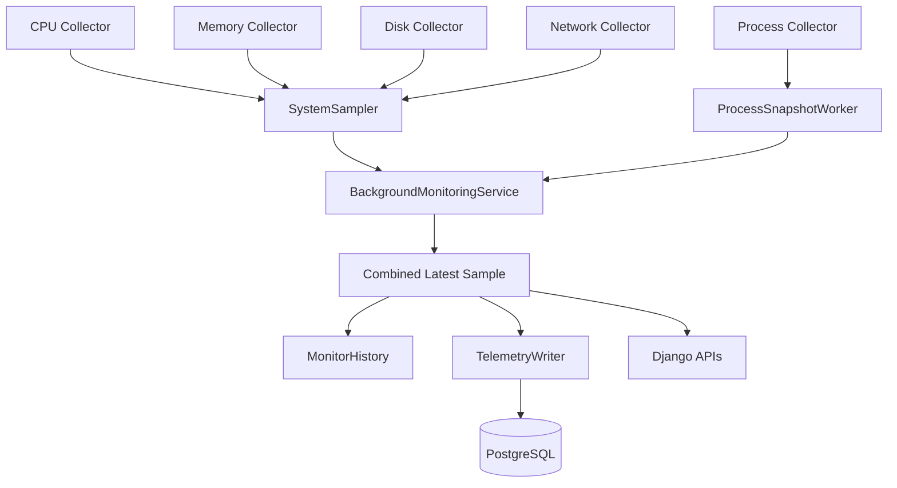
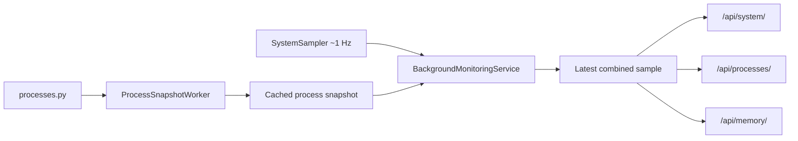
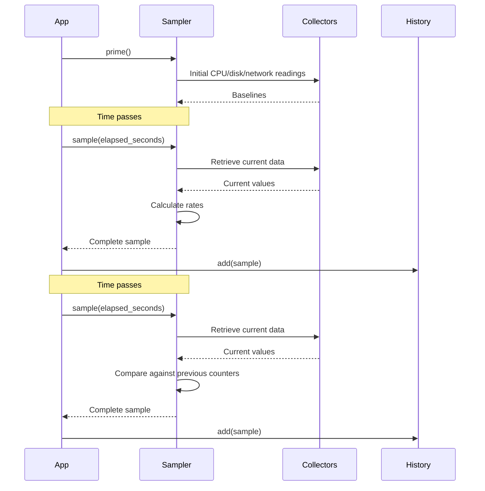
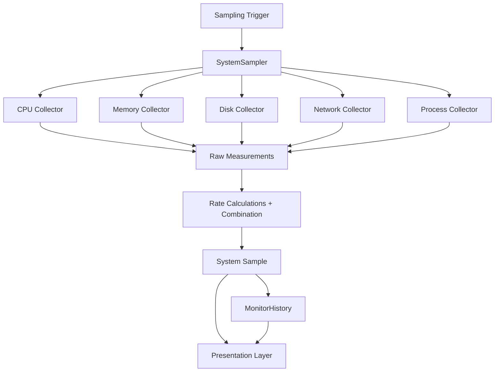
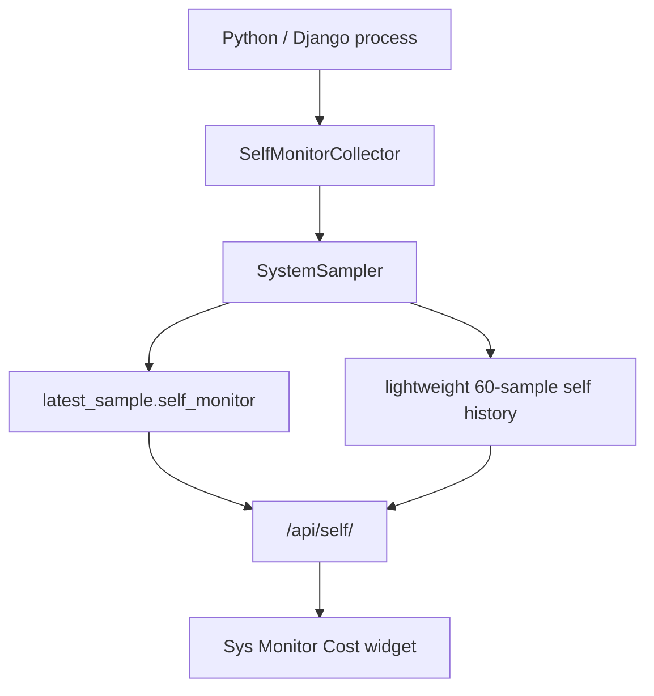
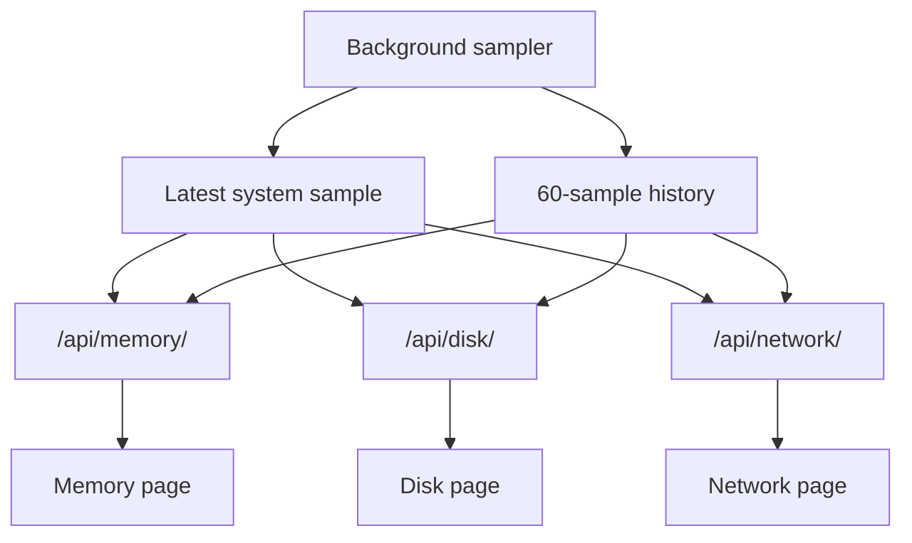
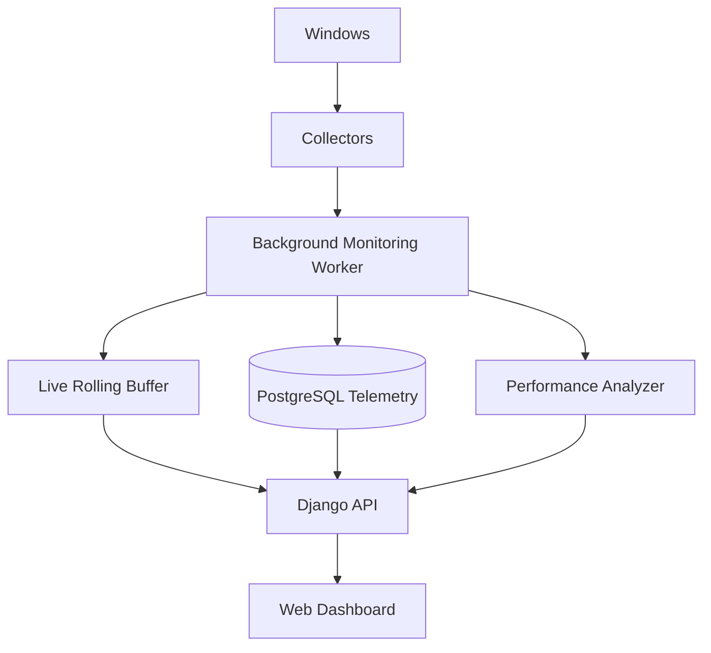

# Monitoring Layer

The monitoring layer sits between the low-level system collectors and the interfaces that display the information.

Its main responsibility is:

> Take raw system measurements, combine them into a consistent snapshot, calculate values that depend on time, and retain recent snapshots for later use.

The monitoring layer currently contains:

```text
src/monitoring/
├── __init__.py
├── sampler.py
├── process_worker.py
└── history.py
```

The main components are:

* `SystemSampler`
* `ProcessSnapshotWorker`
* `MonitorHistory`

For the Django runtime, `BackgroundMonitoringService` coordinates these components and also hands compact combined samples to the telemetry persistence layer.

---

# Overview

The collectors answer questions such as:

```text
What are the current CPU counters?

How many bytes has the disk read since boot?

How many bytes has the network received?

How much RAM is currently available?

Which processes currently exist?
```

These raw values are useful, but some of them are not yet directly suitable for displaying to a user.

For example:

```text
Network bytes received:
2,173,832,073
```

does not tell us the current download speed.

To calculate a rate such as:

```text
3.2 MB/s
```

we need to compare measurements taken at different points in time.

That is the job of the monitoring layer.

---

# Monitoring Architecture



The important separation is:

```text
Collectors
    ↓
retrieve raw information

SystemSampler
    ↓
combine + calculate

MonitorHistory
    ↓
retain recent samples

Interfaces
    ↓
display the information
```

---

# Why Have a Separate Monitoring Layer?

Without a monitoring layer, `monitor.py` or the Django views would need to contain logic such as:

```python
current_network = get_network_usage()

download_speed = (
    current_network["bytes_received"]
    - previous_network["bytes_received"]
) / elapsed_seconds
```

The same calculations would eventually be duplicated in multiple interfaces.

Instead:

```text
Terminal
        \
         \
          → SystemSampler
         /
Dashboard
```

Both interfaces can use the same monitoring logic.

This helps maintain **separation of concerns**.

Each layer has a specific purpose:

| Layer        | Responsibility                            |
| ------------ | ----------------------------------------- |
| Collectors   | Retrieve raw operating-system information |
| Monitoring   | Turn measurements into meaningful samples |
| Presentation | Display those samples to a user           |

---

# `SystemSampler`

File:

```text
src/monitoring/sampler.py
```

The `SystemSampler` is the central component of the monitoring layer.

A simplified structure is:

```python
class SystemSampler:
    def __init__(self):
        self.previous_disk = None
        self.previous_network = None

    def prime(self):
        ...

    def sample(self, elapsed_seconds):
        ...
```

The class has two main responsibilities:

1. Establish the initial measurement baselines.
2. Produce complete system samples.

---

# Why Is `SystemSampler` a Class?

A normal function is often sufficient when an operation does not need to remember anything.

For example:

```python
def get_memory_usage():
    ...
```

can simply retrieve memory and return it.

The sampler is different.

It needs to remember:

```text
previous disk counters
previous network counters
```

between calls.

For example:

```text
Sample 1
read_bytes = 10,000

Sample 2
read_bytes = 15,000
```

To calculate the change during Sample 2, the sampler must still know the value from Sample 1.

This means the sampler contains **state**.

An object is a natural way to represent this:

```text
SystemSampler instance
│
├── previous_disk
├── previous_network
│
├── prime()
└── sample()
```

---

# State

In programming, **state** means information that persists between operations.

For the sampler:

```python
self.previous_disk
```

and:

```python
self.previous_network
```

are state.

Their values change as new samples are taken.

For example:

```text
Initial state

previous_network
    ↓
2,000,000 bytes
```

After the next measurement:

```text
current_network
    ↓
2,500,000 bytes

difference
    ↓
500,000 bytes

then:

previous_network
    ↓
becomes 2,500,000
```

This allows the next measurement to be compared against the newest baseline.

---

# Priming

Before normal monitoring starts, the sampler calls:

```python
sampler.prime()
```

Priming means:

> Take initial measurements that will act as baselines for later calculations.

Some metrics cannot produce useful results from only one observation.

CPU percentages and throughput measurements are examples.

---

# CPU Priming

The project uses non-blocking CPU measurement:

```python
psutil.cpu_percent(interval=None)
```

and:

```python
psutil.cpu_percent(
    interval=None,
    percpu=True
)
```

These functions calculate CPU utilisation by comparing CPU times against an earlier observation.

The first call does not yet have a useful previous observation.

The sampler therefore performs an initial call and ignores its result.

Conceptually:

```text
Time A
│
├── read CPU counters
└── remember them

        time passes

Time B
│
├── read CPU counters again
├── compare against Time A
└── calculate CPU percentage
```

The first measurement is therefore a **baseline**, not a displayed sample.

---

# Process CPU Priming

Individual process CPU percentages behave similarly.

Before the process worker begins normal process snapshots, it calls:

```python
prime_process_cpu()
```

Process CPU priming is now owned by `ProcessSnapshotWorker`, not by `SystemSampler`.

This loops over currently running processes and performs an initial CPU measurement.

Conceptually:

```text
chrome.exe
    ↓
remember current CPU time

Code.exe
    ↓
remember current CPU time

Discord.exe
    ↓
remember current CPU time
```

Later calls can compare how much CPU time each process consumed since the previous observation.

Processes created after the initial prime may initially have no meaningful previous measurement.

That is acceptable because later samples establish the necessary baseline.

---

# Disk Priming

Disk throughput is calculated using cumulative disk I/O counters.

During `prime()`:

```python
self.previous_disk = get_disk_usage()
```

This records the starting values.

Example:

```text
read_bytes:
480,000,000,000

write_bytes:
310,000,000,000
```

These counters continue increasing as the computer performs disk activity.

---

# Network Priming

The same principle applies to network activity:

```python
self.previous_network = get_network_usage()
```

Example baseline:

```text
bytes_received:
2,000,000,000

bytes_sent:
300,000,000
```

The next sample can compare new values against these counters.

---

# Snapshot vs Rate

An important distinction in monitoring is the difference between a **snapshot value** and a **rate**.

## Snapshot

Some values can be meaningfully read immediately:

```text
RAM usage: 48%

Disk capacity used: 92%

Running processes: 287
```

These describe the system at approximately one moment.

---

## Rate

Other values describe change over time:

```text
Download: 5 MB/s

Disk read: 20 MB/s

Disk write: 3 MB/s
```

A rate requires at least:

```text
starting value
ending value
elapsed time
```

The sampler is responsible for converting cumulative counters into rates.

---

# Cumulative Counters

Disk and network I/O values are currently obtained as cumulative counters.

Imagine a counter that begins at system boot:

```text
System boots

bytes_received = 0
```

As network traffic arrives:

```text
after 1 minute
bytes_received = 50,000,000

after 10 minutes
bytes_received = 700,000,000

after 1 hour
bytes_received = 4,200,000,000
```

The number does not represent current speed.

It represents:

> How many bytes have been received since the counter began.

To determine current throughput, the sampler calculates the **difference between samples**.

---

# Calculating a Rate

Suppose the network collector reports:

```text
First sample:
2,000,000,000 bytes received
```

Later:

```text
Second sample:
2,010,000,000 bytes received
```

The difference is:

```text
10,000,000 bytes
```

If one second elapsed:

```text
10,000,000 bytes
----------------
1 second
```

gives approximately:

```text
10,000,000 bytes per second
```

The general idea is:

```text
current counter - previous counter
----------------------------------
elapsed time
```

This pattern is used by Sys Monitor for:

* disk reads
* disk writes
* network downloads
* network uploads

---

# Disk Read Throughput

The sampler calculates:

```python
disk_read_speed = (
    disk["read_bytes"]
    - self.previous_disk["read_bytes"]
) / elapsed_seconds
```

The result is stored in:

```text
bytes per second
```

For example:

```text
13,500,000 bytes/s
```

The presentation layer may later convert this into:

```text
12.87 MB/s
```

---

# Disk Write Throughput

Disk write speed uses the same calculation:

```python
disk_write_speed = (
    disk["write_bytes"]
    - self.previous_disk["write_bytes"]
) / elapsed_seconds
```

This represents how quickly data was written to storage during the measured interval.

---

# Network Download Throughput

Download speed is calculated from:

```python
network["bytes_received"]
```

The sampler performs:

```python
download_speed = (
    network["bytes_received"]
    - self.previous_network["bytes_received"]
) / elapsed_seconds
```

The result is measured in:

```text
bytes per second
```

---

# Network Upload Throughput

Upload speed is calculated using:

```python
network["bytes_sent"]
```

The sampler performs:

```python
upload_speed = (
    network["bytes_sent"]
    - self.previous_network["bytes_sent"]
) / elapsed_seconds
```

---

# Why Not Assume Exactly One Second?

The monitor currently aims to take approximately one sample per second.

It would be tempting to write:

```python
speed = byte_difference / 1
```

However, the real interval may not be exactly:

```text
1.000 seconds
```

The application itself takes time to:

* enumerate processes
* read system counters
* calculate results
* print terminal output
* handle web requests
* perform Python operations

The actual interval might instead be:

```text
1.034 seconds
```

or:

```text
1.121 seconds
```

Using a fixed divisor of `1` would therefore introduce measurement error.

---

# Measuring Actual Elapsed Time

The terminal monitor uses:

```python
time.perf_counter()
```

Example:

```python
previous_time = time.perf_counter()
```

Later:

```python
current_time = time.perf_counter()

elapsed_seconds = (
    current_time - previous_time
)
```

The actual duration is then supplied to:

```python
sampler.sample(
    elapsed_seconds=elapsed_seconds
)
```

---

# Why `perf_counter()`?

Python provides several ways of working with time.

The project uses:

```python
time.perf_counter()
```

for measuring elapsed durations.

This is different from asking:

```text
What time is it?
```

For example:

```python
datetime.now()
```

is useful for producing:

```text
2026-08-12 20:30:14
```

But for measuring how much time passed between two operations, a performance counter is more appropriate.

Conceptually:

```text
datetime.now()
    ↓
wall-clock timestamp

time.perf_counter()
    ↓
elapsed-time measurement
```

We use both, but for different purposes.

---

# Timestamp vs Timing

Each generated system sample includes:

```python
"timestamp": datetime.now()
```

This answers:

> When was this sample taken?

For example:

```text
20:43:21
```

The sampler also receives:

```python
elapsed_seconds
```

which answers:

> How much time passed since the previous sample?

These values serve different purposes.

```text
Timestamp
    ↓
useful for graphs and logs

Elapsed time
    ↓
useful for rate calculations
```

---

# Taking a Sample

Once the fast sampler has been primed, one `SystemSampler.sample()` call now looks roughly like this:

```text
Call CPU collector
       ↓
Call memory collector
       ↓
Call disk collector
       ↓
Call network collectors
       ↓
Calculate disk/network rates
       ↓
Use latest cached process list only where needed
       ↓
Collect self-overhead
       ↓
Create fast system sample
       ↓
Update previous counters
       ↓
Return
```

The expensive `get_processes()` enumeration is **not** performed here anymore. It runs independently inside `ProcessSnapshotWorker`.

`BackgroundMonitoringService` then combines:

```text
fast system sample
        +
cached process snapshot
        ↓
combined latest sample
```

before publishing the result to APIs, short-term history and telemetry persistence.

# Sample Structure

The Django monitoring service publishes one combined object after merging the fast `SystemSampler` result with the latest cached process snapshot.

A simplified structure is:

```python
{
    "timestamp": ...,

    "cpu": {
        "percent": ...,
        "per_cpu_percent": ...,
        "physical_cores": ...,
        "logical_processors": ...
    },

    "memory": {
        "percent": ...,
        "total_bytes": ...,
        "available_bytes": ...,
        "in_use_bytes": ...,
        "pagefile": {...}
    },

    "disk": {
        "percent": ...,
        "read_bytes_per_second": ...,
        "write_bytes_per_second": ...
    },

    "network": {
        "download_bytes_per_second": ...,
        "upload_bytes_per_second": ...,
        "interfaces": [...],
        "connections": [...]
    },

    "processes": {
        "count": ...,
        "top_cpu": ...,
        "top_memory": ...,
        "items": ...,
        "collection_duration_ms": ...,
        "ready": ...
    },

    "self_monitor": {
        "cpu_percent": ...,
        "memory_bytes": ...,
        "sample_duration_ms": ...,
        "process_collection_duration_ms": ...
    }
}
```

This combined sample is the main live contract used by the Django APIs.

A smaller version is copied into `MonitorHistory`, and an even more compact subset is written by `TelemetryWriter` to PostgreSQL.

# Why Use One Common Sample?

Without a common combined structure, each interface might separately request or collect:

```text
CPU
memory
disk
network
processes
```

That would duplicate work and could produce inconsistent values.

Instead:

```text
SystemSampler        ProcessSnapshotWorker
      │                       │
      └──────────┬────────────┘
                 ▼
      BackgroundMonitoringService
                 │
      ┌──────────┼──────────┐
      ▼          ▼          ▼
 live APIs   MonitorHistory TelemetryWriter
                            ↓
                        PostgreSQL
```

This gives the web application a stable internal representation while allowing each data source to use an appropriate sampling cadence.

# Raw Values vs Presentation Values

The sampler usually stores resource quantities using base units such as:

```text
bytes

bytes per second

percentages
```

It does not generally format them as:

```text
15.3 GB

4.2 MB/s

"48% used"
```

That formatting belongs to the presentation layer.

For example:

```text
Sampler:

16445685760 bytes
        ↓

Terminal:
15.32 GB
        ↓

Web dashboard:
15.3 GB
```

The underlying measurement remains the same.

---

# Process Rankings

`ProcessSnapshotWorker` receives the full accessible process list from the process collector and computes:

```python
get_top_cpu_processes(
    processes,
    limit=5
)
```

and:

```python
get_top_memory_processes(
    processes,
    limit=5
)
```

The worker publishes:

- `top_cpu`
- `top_memory`
- `processes`
- `collection_duration_ms`
- `ready`

`BackgroundMonitoringService` attaches those values to the latest combined sample.

The complete process list is deliberately omitted from every rolling-history entry so hundreds of process objects are not duplicated 60 times. PostgreSQL persistence is even more compact: it stores the process count plus only the top CPU and top memory process attribution for each persisted telemetry sample.

# Shared Process Sampling

The earlier design collected the full process list inside every `SystemSampler.sample()` call. Profiling with the self-overhead instrumentation showed that process enumeration dominated the sample:

```text
Before separation

System sample total       ~1200–1300 ms
Process collection        ~1200 ms
Everything else           tens of milliseconds
```

This meant a nominal one-second loop actually produced samples roughly every two seconds because the process scan blocked the fast path.

Process collection is now separated:



`ProcessSnapshotWorker` runs in its own daemon thread. It owns:

* process CPU priming
* the expensive `get_processes()` call
* top CPU ranking
* top memory ranking
* process-collection timing
* a lock-protected cached process snapshot

The service reads this snapshot without causing another enumeration.

After the separation, the fast system sample on the development PC typically dropped to roughly:

```text
~50–130 ms
```

while process enumeration can still take roughly:

```text
~1.5 seconds
```

The important change is that the slow operation no longer blocks CPU, memory, disk and network sampling.

The process data therefore has a different freshness cadence from the fast resource data. This is an intentional design choice:

```text
CPU / memory / disk / network
    → approximately every 1 second

Processes
    → independent cached refresh

Network socket list
    → slower cached refresh

PostgreSQL persistence
    → approximately every 5 seconds
```

This demonstrates that different metrics can use different sampling frequencies according to their cost and how quickly they need to update.

# Updating Previous Counters

After the sample has been calculated:

```python
self.previous_disk = disk
self.previous_network = network
```

This is an important step.

The current sample becomes the baseline for the next sample.

Conceptually:

```text
Sample 1
     ↓
previous

Sample 2
     ↓
compare with Sample 1
     ↓
Sample 2 becomes previous

Sample 3
     ↓
compare with Sample 2
     ↓
Sample 3 becomes previous
```

This creates a continuous chain of measurements.

---

# Sampling Timeline

A simplified monitoring session looks like:



---

# `MonitorHistory`

File:

```text
src/monitoring/history.py
```

The second main component of the monitoring layer is:

```python
MonitorHistory
```

Its responsibility is:

> Store a limited number of recent system samples.

It does not collect system data itself.

---

# Why Store History?

A single sample tells us:

```text
CPU right now:
17%
```

But monitoring becomes much more useful when we can see change over time:

```text
20:00:01    8%
20:00:02   10%
20:00:03   14%
20:00:04   72%
20:00:05   84%
20:00:06   22%
```

This allows us to identify:

* spikes
* trends
* sustained resource usage
* periods of inactivity
* relationships between metrics

History is therefore required for graphs and later performance analysis.

---

# `deque`

`MonitorHistory` currently uses:

```python
from collections import deque
```

and creates:

```python
deque(maxlen=60)
```

A `deque` is a double-ended queue.

It supports efficient addition and removal of items from either end.

For Sys Monitor, the particularly useful feature is:

```python
maxlen=60
```

which creates a **bounded deque**.

---

# Bounded History

Suppose the deque can contain five values:

```text
maxlen = 5
```

After five samples:

```text
[1, 2, 3, 4, 5]
```

Add sample 6:

```text
[2, 3, 4, 5, 6]
```

Sample 1 is removed automatically.

Add sample 7:

```text
[3, 4, 5, 6, 7]
```

The history therefore behaves as a rolling window.

---

# Why 60 Samples?

The current application uses:

```python
HISTORY_SIZE = 60
```

and aims for approximately:

```text
1 sample per second
```

Therefore:

```text
60 samples
×
approximately 1 second
=
approximately 60 seconds
```

This gives us a useful short-term live performance graph.

The choice of 60 is not a technical requirement.

It is simply appropriate for the current dashboard.

Future interfaces could use:

```text
60 seconds

5 minutes

1 hour

24 hours

7 days
```

depending on how history is stored.

---

# MonitorHistory Interface

The history class currently provides a small interface.

## Add a sample

```python
history.add(sample)
```

Appends the newest measurement.

---

## Retrieve all retained samples

```python
history.get_all()
```

Returns the current history.

This is useful for:

* charts
* APIs
* debugging

---

## Retrieve the newest sample

```python
history.latest()
```

Returns the most recently stored measurement.

If no samples have been collected yet:

```python
None
```

is returned.

---

## Get history length

The class implements:

```python
__len__()
```

which allows:

```python
len(history)
```

For example:

```text
History: 34 / 60 samples
```

---

# Why Wrap `deque` in a Class?

We could directly write:

```python
history = deque(maxlen=60)
```

throughout the project.

Instead, the project uses:

```python
MonitorHistory
```

This creates an abstraction around history storage.

The rest of the application knows:

```python
history.add(sample)

history.get_all()

history.latest()
```

but does not need to know that the implementation currently uses a deque.

This gives us flexibility.

---

# Future History Implementations

Today:

```text
MonitorHistory
    ↓
deque
    ↓
RAM only
```

Later we could introduce:

```text
Monitoring repository
    ↓
SQLite
```

or:

```text
Monitoring repository
    ↓
PostgreSQL
```

without requiring every consumer to understand the database implementation.

Eventually the application may distinguish:

```text
Live history
    ↓
small in-memory rolling buffer

Persistent history
    ↓
database
```

For example:

```text
last 60 seconds
    ↓
RAM deque

last 30 days
    ↓
database
```

---

# Why Keep History in Memory for Now?

The first dashboard only needs a small amount of recent data.

A database would introduce additional complexity:

* database models
* migrations
* writes every second
* retention policies
* aggregation
* cleanup
* storage growth

For the current learning stage:

```python
deque(maxlen=60)
```

is:

* simple
* fast
* bounded
* easy to understand

It gives us enough functionality to build live graphs before introducing persistent monitoring.

---

# Memory Usage of History

A bounded history also prevents unlimited memory growth.

Without a limit:

```text
1 sample
2 samples
100 samples
10,000 samples
1,000,000 samples
...
```

The application would continuously consume additional RAM.

With:

```python
maxlen=60
```

the number of retained samples never exceeds 60.

Therefore the memory requirement remains approximately constant.

This is an example of a **fixed-size rolling buffer**.

---

# Rolling Buffer

The history structure can be thought of as a window moving through time.

```text
Earlier:

[01][02][03][04][05]

          ↓ time

Later:

[02][03][04][05][06]

          ↓ time

Later:

[03][04][05][06][07]
```

The window always contains only the newest observations.

This pattern is common in:

* monitoring software
* streaming systems
* signal processing
* telemetry
* real-time charts
* moving-average calculations

---

# Monitor Loop

The terminal monitor currently controls the sampling schedule.

A simplified version is:

```python
sampler = SystemSampler()
history = MonitorHistory(max_samples=60)

sampler.prime()

previous_time = time.perf_counter()

while True:
    time.sleep(1)

    current_time = time.perf_counter()

    elapsed_seconds = (
        current_time - previous_time
    )

    sample = sampler.sample(
        elapsed_seconds
    )

    history.add(sample)

    print_sample(
        sample,
        history
    )

    previous_time = current_time
```

This loop coordinates:

```text
timing
sampling
history
presentation
```

but the monitoring calculations themselves remain inside the monitoring classes.

---

# Why Does the Main Loop Control Timing?

The CPU collector could use:

```python
psutil.cpu_percent(interval=1)
```

which would block for one second.

Instead the project uses non-blocking measurements and lets the outer application control timing.

This provides more flexibility.

The application can eventually change:

```text
1 second
```

to:

```text
500 milliseconds
```

or:

```text
5 seconds
```

without embedding timing delays inside individual collectors.

It also prevents different collectors from introducing their own independent waits.

---

# Blocking vs Non-Blocking Sampling

A blocking approach might look like:

```text
CPU collector
    ↓
wait 1 second
    ↓
return CPU

memory collector
    ↓
return memory

disk collector
    ↓
return disk
```

The CPU collector controls the timing of the whole cycle.

Our design is closer to:

```text
Monitoring loop
    ↓
wait until next sample
    ↓
call all collectors
    ↓
return immediately
```

The outer monitoring system therefore owns the sampling schedule.

---

# Graceful Shutdown

The terminal monitor runs continuously until the user stops it.

Pressing:

```text
Ctrl + C
```

causes Python to raise:

```python
KeyboardInterrupt
```

The monitor handles it:

```python
try:
    while True:
        ...

except KeyboardInterrupt:
    print("Stopping...")

finally:
    print("Monitor stopped cleanly.")
```

Without this handling, Python would normally display a traceback.

The graceful structure also gives us a place for future cleanup operations.

Possible future cleanup might include:

* flushing samples to disk
* closing database connections
* stopping worker threads
* closing files
* shutting down network connections

---

# Sampling and the Web Dashboard

The same concepts are also used by the Django interface.

The dashboard does not directly call:

```python
psutil.cpu_percent()
```

Instead:

```text
Django
   ↓
BackgroundMonitoringService
   ↓
SystemSampler
   ↓
Collectors
```

The result is returned through:

```text
/api/system/
```

The web interface therefore benefits from exactly the same monitoring calculations used by the terminal application.

---

# Current Django Sampling Behaviour

The Django web monitor uses background workers rather than browser-request-driven collection.

```text
                 Django Python process
                         │
          ┌──────────────┴──────────────┐
          ▼                             ▼
  sys-monitor-sampler          process-snapshot-worker
  ~1 second target             slower independent refresh
          │                             │
          ▼                             ▼
    SystemSampler                cached processes
          └──────────────┬──────────────┘
                         ▼
             BackgroundMonitoringService
                         │
               latest sample + history
                         │
               ┌─────────┴─────────┐
               ▼                   ▼
        live JSON APIs       TelemetryWriter
                                   │
                                   ▼
                              PostgreSQL
```

Only background workers perform system/process collection. HTTP requests read already-collected state. Closing the browser therefore stops frontend polling but **does not stop monitoring or telemetry persistence** while the Django Python process remains alive.

# Background Monitoring Thread

`BackgroundMonitoringService.start()` starts the independent `ProcessSnapshotWorker`, primes the fast `SystemSampler`, and creates the `sys-monitor-sampler` thread whose target is the service's `_run()` method.

The main loop uses a fixed-rate-ish schedule. It measures how long the current sampling work took and subtracts that work time from the next wait.

For example:

```text
target interval       1000 ms
sample work            100 ms
remaining wait         900 ms
```

This keeps sample starts close to the intended one-second cadence instead of producing:

```text
1 second wait + sample duration
```

The two worker responsibilities are therefore:

```text
sys-monitor-sampler
    ↓
fast system metrics

process-snapshot-worker
    ↓
slower process enumeration
```

Both are stopped through `BackgroundMonitoringService.stop()` rather than relying only on daemon-thread termination.

# Thread Events and Shutdown

The service uses two `threading.Event` objects:

- `_ready_event` indicates that at least one useful sample has been produced.
- `_stop_event` tells the worker to stop.

The sampling loop waits with `_stop_event.wait(sample_interval)` instead of a plain `time.sleep()`. This means a shutdown request can wake the worker immediately rather than waiting for the full interval.

`stop()` sets the stop event and then calls `thread.join(timeout=2)`, allowing the calling thread to wait briefly for the sampler to finish. `atexit.register(monitoring_service.stop)` requests this graceful shutdown during normal interpreter exit. `daemon=True` remains a final safety net so the worker cannot keep Python alive indefinitely.

---

# Thread Safety

`SystemSampler` contains mutable state:

```text
previous disk counters
previous network counters
```

`MonitorHistory` also changes as samples are added.

This means concurrent access must be handled carefully.

The background worker writes shared monitoring state while Django request threads read it. The service protects this state with a `threading.RLock()`.

```text
Background worker              API request
       │                           │
       ├── acquire lock            │
       ├── publish sample          │ waits briefly
       └── release lock            │
                                   ├── acquire lock
                                   ├── copy latest data
                                   └── release lock
```

The API receives deep copies of the latest sample/history so it can serialize them without holding the lock for the entire HTTP response. The `SystemSampler` itself remains focused on measurement rather than providing its own concurrency layer.

---

# Design Decision: Collector vs Sampler

One important architectural rule is:

> Collectors retrieve values. The sampler interprets values across time.

For example:

## Network collector

Returns:

```text
bytes_received
bytes_sent
```

## Sampler

Calculates:

```text
download bytes per second
upload bytes per second
```

This separation is deliberate.

The collector does not know:

* when the previous sample happened
* what the sampling interval is
* how history is stored

The sampler does.

---

# Design Decision: Sampler vs History

Similarly:

> The sampler creates samples. History stores samples.

The sampler does not need to know whether we retain:

```text
10 samples
60 samples
10,000 samples
```

It simply returns a result.

`MonitorHistory` decides how many samples to retain.

This gives us:

```text
SystemSampler
      ↓
one sample

MonitorHistory
      ↓
many samples
```

---

# Design Decision: Monitoring vs Presentation

The monitoring layer should not decide how data looks.

It should not produce strings such as:

```text
"CPU usage is 14.8%"

"Download is 3.42 MB/s"

"RAM is 15.3 GB"
```

Instead it returns values such as:

```python
14.8

3586129.2

16445685760
```

The presentation layer decides whether those become:

```text
14.8%

3.42 MB/s

15.3 GB
```

This allows different interfaces to format the same information differently.

---

# Current Monitoring Flow

The complete current monitoring flow is:



---

# Data Transformation

One of the main jobs of the monitoring layer is transforming data.

For example:

```text
RAW NETWORK COUNTERS

previous:
2,000,000,000 bytes

current:
2,010,000,000 bytes

elapsed:
1.02 seconds

        ↓

MONITORING CALCULATION

10,000,000 / 1.02

        ↓

9,803,921 bytes/sec

        ↓

PRESENTATION

9.35 MB/s
```

Each layer performs a different transformation.

---


# Self-Monitoring the Monitor

The background sampler now measures the cost of running Sys Monitor itself. This is integrated into the **existing** one-second sampling cycle rather than creating a second independent monitoring loop.



`SelfMonitorCollector.prime()` establishes CPU and I/O baselines before normal sampling begins. Each later collection reads the backend process's CPU, resident memory, cumulative I/O counters, thread count, handle count and uptime.

The process CPU value is stored in two forms:

```text
raw_cpu_percent
    → psutil's process CPU interpretation

cpu_percent
    → raw value divided by logical-processor count
    → approximate share of whole-machine CPU capacity
```

Process I/O uses the same stateful delta/rate idea as disk and network throughput:

```text
cumulative process I/O counters
        ↓
current - previous
        ↓
delta bytes
        ↓
÷ elapsed seconds
        ↓
read/write bytes per second
```

`SystemSampler` also records `sample_duration_ms` using `time.perf_counter()`. This measures how long one complete monitoring cycle took in wall-clock time.

The Network collector has already produced a socket list for the current sample, so the self-monitor feature reuses that data and counts sockets whose PID matches the Sys Monitor process. It does **not** run a second `net_connections()` scan.

The rolling history deliberately stores only a small self-overhead subset: CPU percentage, RAM bytes, read/write I/O rates and sample duration. This keeps the 60-sample buffer compact.

## Backend Scope

The current self monitor measures the Python/Django backend process. Browser rendering cost is outside this measurement because Chart.js, Cytoscape and DOM rendering execute in the browser process.

## Observer Effect

Monitoring is not free. Reading `/api/self/`, rendering the widget and collecting the self metrics all consume a small amount of resources themselves. This is an example of the **observer effect**: observing a system can slightly change the system being observed.

Sys Monitor limits this effect by collecting self metrics inside the existing sampling cycle, making `/api/self/` read an existing snapshot instead of calling psutil again, and polling the floating widget every two seconds rather than every second.

---

# Dedicated Memory, Disk and Network Views

The background sampler now supports dedicated resource pages without creating additional collection loops. `BackgroundMonitoringService` exposes:

```text
/api/memory/
/api/disk/
/api/network/
```

These endpoints read the same latest sample and rolling history already maintained for the rest of the application.



The Memory endpoint returns the current memory snapshot, memory history and a Top Memory process ranking derived from the **already collected complete process list**. It does not call `psutil.process_iter()` again.

The Disk endpoint exposes the current capacity/read/write values and a 60-sample history of read/write throughput. It likewise performs no additional disk collection.

The Network endpoint exposes the latest system-wide upload/download rates, per-interface rates and metadata, and the current socket list. Its history keeps only the lightweight upload/download rates rather than duplicating every socket across all 60 samples.

The Memory and Disk pages also make one separate request to `/api/hardware/` for slow-changing DIMM and physical-drive information. This keeps live telemetry and static hardware identity separate.

---

# Asynchronous Hostname Enrichment

Remote socket endpoints are initially identified by IP address. `HostnameResolver` performs best-effort reverse-DNS lookups in a small `ThreadPoolExecutor` rather than blocking the main monitoring or HTTP path.

```text
remote IP
   ↓
cache lookup
   ├── hit  → return hostname
   └── miss → schedule background DNS lookup
                    ↓
             later API response can include hostname
```

This is an example of **asynchronous enrichment**: the core network measurement remains useful immediately, while slower optional metadata can arrive later. Failed lookups are allowed and simply leave the hostname unavailable.

---

# Static Hardware Data Is Kept Separate

The live monitoring layer is designed for values that change continuously, such as CPU usage, RAM usage, disk throughput and processes. Hardware identity is handled separately.

```text
LIVE PERFORMANCE
BackgroundMonitoringService
        ↓
sample ~once / second

STATIC HARDWARE
HardwareService
        ↓
collect once + cache
```

`HardwareService` calls the hardware collector, normalises the Windows/CIM result, builds educational explanations and caches the result for `/api/hardware/`. This avoids repeatedly querying motherboard, BIOS, RAM-module and hardware-model information that rarely changes while the program is running.

This gives the project two distinct data lifecycles:

- **live telemetry** — continuously sampled
- **hardware identity** — collected on demand and cached

---
# Persistent Telemetry with PostgreSQL

The project now has a second kind of history in addition to `MonitorHistory`.

```text
MonitorHistory
    ↓
60 recent samples
    ↓
RAM only
    ↓
fast live graphs

PostgreSQL telemetry
    ↓
compact samples approximately every 5 seconds
    ↓
durable across application restarts
    ↓
future analytics
```

The persistence code lives in the Django app:

```text
src/telemetry/
├── models.py
├── writer.py
└── migrations/
```

## Django ORM Models

`models.py` currently defines three models.

### `Device`

Represents a monitored device rather than baking one specific PC into every telemetry row.

Important fields include:

```text
key
name
device_type
hostname
manufacturer
model
created_at
last_seen_at
```

`DeviceType` currently includes Windows and Android values, which gives the schema a place for a later phone-monitoring extension.

### `SystemMetricSample`

Stores compact machine telemetry such as:

```text
timestamp
CPU %
memory % / in-use / available
page-file %
disk capacity and read/write throughput
network download/upload throughput
process count
top CPU process
top memory process
```

The full live process list and network socket list are deliberately **not** persisted every five seconds.

### `MonitorOverheadSample`

Stores the monitoring backend's own historical overhead separately:

```text
backend PID
CPU %
memory
read/write I/O
sample duration
thread count
handle count
network socket count
```

Keeping system telemetry and monitor-overhead telemetry in separate tables makes their meanings explicit.

## `TelemetryWriter`

`src/telemetry/writer.py` converts the existing combined sample dictionary into ORM rows.

```text
BackgroundMonitoringService
        ↓
latest combined sample
        ↓
TelemetryWriter.write_if_due()
        ↓
Django ORM
        ↓
PostgreSQL
```

The writer uses `time.monotonic()` to decide when approximately five seconds have elapsed. It then creates one `SystemMetricSample`, one `MonitorOverheadSample`, and updates `Device.last_seen_at`.

The writes are wrapped in:

```python
with transaction.atomic():
    ...
```

so the related database operations are committed as one unit or rolled back together if a database operation fails.

Because telemetry writes happen from a long-running background thread rather than a normal HTTP request lifecycle, the writer also calls:

```python
close_old_connections()
```

around its database work.

Database failures are isolated from the live monitor: `BackgroundMonitoringService` logs persistence failures but continues publishing live samples.

## PostgreSQL Setup

The development setup uses:

```text
PostgreSQL 18
Django 6
Psycopg 3
Django ORM
```

Django's `DATABASES` setting uses the PostgreSQL backend and reads local credentials from environment variables / `.env`.

Conceptually:

```text
Django model / QuerySet
        ↓
Django ORM
        ↓
Django PostgreSQL backend
        ↓
Psycopg
        ↓
PostgreSQL server
```

Migrations convert model definitions into database schema changes:

```powershell
python manage.py makemigrations telemetry
python manage.py migrate
```

The telemetry tables therefore belong to PostgreSQL even though most application code interacts with them using Python model classes rather than hand-written SQL.

---

# Current Limitations

The monitoring layer is still intentionally simple.

Current limitations include:

* the background worker currently runs inside the Django Python process rather than as a separate Windows service/process
* live rolling history is still only 60 in-memory samples; PostgreSQL is used for separate durable telemetry
* no long-term telemetry query/service layer has been built yet
* memory history is high-level and does not yet include Windows standby/cache, pool or page-fault counters
* disk throughput history is system-wide rather than attributed to individual processes or physical devices
* network connection monitoring is socket-level rather than packet-level
* network byte rates are not yet attributed directly to individual processes
* reverse-DNS hostname enrichment is best-effort
* no configurable sampling interval through the UI
* no long-term aggregation
* no moving averages
* no anomaly detection
* no event correlation
* no historical process tracking
* no persistence of process start/stop events
* sampling duration is measured, but there is not yet a dedicated performance-analysis view for the sampler/process worker
* no automatic handling of suspended/resumed system time

---

# Possible Future Monitoring Features

Future monitoring logic may include:

## Historical Query Layer

Persistence now exists in PostgreSQL. The next step is to query the stored telemetry over periods such as:

```text
last hour
last day
last week
last month
```

The query layer can calculate averages, peaks, totals and time-window series without changing the live-monitoring API.

---

## Aggregation

Instead of storing every one-second sample forever:

```text
1-second data
    ↓
aggregate

1-minute averages
    ↓
aggregate

1-hour averages
```

This reduces storage requirements.

---

## Spike Detection

Example:

```text
Normal CPU:
10–25%

Sudden sample:
96%

        ↓

CPU spike detected
```

---

## Sustained Load Detection

Rather than reacting to one high measurement:

```text
CPU > 90%
for 30 seconds
```

could trigger an event.

---

## Memory Leak Detection

A process whose memory usage continually grows:

```text
100 MB
120 MB
145 MB
180 MB
240 MB
...
```

could be identified as potentially leaking memory.

---

## Correlation

The monitor could later answer questions such as:

```text
CPU spike
    +
disk activity spike
    +
specific process CPU spike
        ↓

Likely cause:
process X
```

This would move the project from simple monitoring toward performance diagnosis.

---

# Future Monitoring Architecture

The current background workers already separate sampling from browser requests, and PostgreSQL now provides persistent telemetry. A later production-style version may move those workers into a separate process/service:



In this model:

* monitoring remains independent of browser requests
* the worker can survive or restart independently of Django
* history can survive application restarts
* analytics can operate independently of the UI

---

# Learning Concepts Covered

The monitoring layer introduces several important programming and computer-science concepts.

## Sampling

Observing a system repeatedly at intervals.

---

## Time Series

A collection of measurements ordered by time.

Example:

```text
time        CPU
20:01:01    10%
20:01:02    14%
20:01:03    29%
```

---

## Rate of Change

Calculating how quickly a cumulative value changes.

Used for:

* disk throughput
* network throughput

---

## State

Remembering information between operations.

Examples:

```text
previous disk counters
previous network counters
```

---

## Rolling Buffer

Keeping only the newest fixed number of observations.

Implemented using:

```python
deque(maxlen=60)
```

---

## Separation of Concerns

Keeping:

```text
data retrieval

data interpretation

data storage

presentation
```

in separate components.

---

## Abstraction

The rest of the application asks:

```python
sampler.sample(...)
```

without needing to know every individual psutil call underneath it.

---

## Concurrency

Multiple requests may attempt to access shared monitoring state.

The Django service currently controls this using a lock.

---

## Monotonic / Elapsed-Time Measurement

Using an elapsed-time-oriented clock such as:

```python
time.perf_counter()
```

for performance measurements rather than relying on wall-clock timestamps.

---

# Summary

The collector layer asks:

> What values does Windows expose right now?

The monitoring layer asks:

> What do those measurements mean when compared over time?

`SystemSampler` handles the fast system metrics and time-based rate calculations.

`ProcessSnapshotWorker` performs expensive process enumeration independently and publishes a cached snapshot.

`BackgroundMonitoringService` combines those data sources, `MonitorHistory` retains the short live window, and `TelemetryWriter` persists compact samples through the Django ORM into PostgreSQL.

Together these components provide both low-latency live monitoring and the durable data foundation required for analytics.

The next documentation layer, `architecture.md`, will step back from individual classes and describe how all major project components communicate from Windows system information through to the terminal and browser interfaces.
